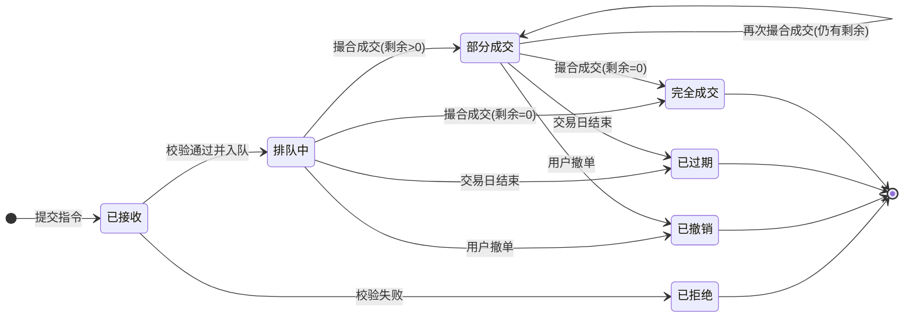

# 系统设计报告_存在问题修正_伪代码格式统一 (1)

股票交易系统 中央交易子系统

【股票交易系统】

——中央交易子系统

设计说明书

组长：杨钞越

组员：程文博、李嘉诚、李佳雨、笪子游

日期：2026.05

版本：V1.0

目 录

# 1.文档介绍

## 1.1  编写目的

本文档用于说明股票中央交易系统中央交易子系统的设计方案，明确系统总体结构、核心对象、模块职责、接口边界、数据库逻辑结构、交易日初始化设计和系统维护设计。

本文档作为后续编码实现、接口联调、测试验收和报告整合的依据。杨钞越负责本文档中总体架构、数据模型、股票交易日配置、接口统一、数据库逻辑结构和系统维护部分，并对全组术语、字段和图表编号进行统一。

## 1.2 文档范围

本文档覆盖中央交易子系统内部设计，包括股票与交易日配置、指令接收与校验、订单簿管理、撮合成交、成交记录、账户结算消息、客户端反馈、行情基础数据、撤单和交易日结束过期处理。

## 1.3 读者对象

| 读者对象 | 阅读重点 |
| --- | --- |
| 组长/项目管理人员 | 系统范围、模块边界、接口一致性、字段统一、最终交付检查。 |
| 开发成员 | 模块职责、输入输出、核心对象、状态转换、接口调用规则。 |
| 测试成员 | 核心流程、异常分支、验收标准、数据库字段和接口返回。 |
| 其他子系统成员 | 中央交易系统与客户端、账户系统、管理模块、网上信息发布系统之间的协作边界。 |

## 1.4 术语与缩写解释

| 术语/缩写 | 解释 |
| --- | --- |
| 中央交易系统 | 接收股票买卖指令、维护订单簿、执行撮合、生成成交记录并反馈结果的核心子系统。 |
| 交易指令 TradeOrder | 投资者提交的买入或卖出委托，包含股票代码、账户编号、买卖方向、价格、数量和状态等字段。 |
| 订单簿 OrderBook | 按股票代码维护买入队列和卖出队列的数据结构。 |
| 价格优先 | 买入指令价格高者优先；卖出指令价格低者优先。 |
| 时间优先 | 价格相同的指令，进入中央交易系统时间更早者优先。 |
| 涨停价/跌停价 | 交易日内允许的最高交易价格和最低交易价格。普通股按 10%，ST 股票按 5% 计算。 |
| 反馈事件 FeedbackEvent | 系统向交易客户端发送的受理、拒绝、部分成交、完全成交、撤销、过期等状态通知。 |
| 结算消息 SettlementMessage | 中央交易系统生成并发送给资金账户系统、证券账户系统的资金或证券变更消息。 |

## 1.5    参考资料

| 序号 | 文档名称 | 文档编号/来源 | 版本 | 发布日期 |
| --- | --- | --- | --- | --- |
| 1 | 系统设计报告模板 | 系统设计报告（模板）.docx | V1.0 | 2026.05 |
| 2 | 股票中央交易系统需求分析报告 | 股票中央交易系统需求分析报告.pdf | V1.0 | 2026.05 |
| 3 | 中央交易系统业务材料 | 中央交易系统业务.md | V1.0 | 2026.05 |
| 4 | 中央交易系统业务逻辑说明 | 业务逻辑.md | V1.0 | 2026.05 |
| 5 | 股票中央交易系统设计报告分工说 | 分工.md | V1.0 | 2026.05 |

# 2.项目介绍

## 2.1 项目说明

| 项目属性 | 内容 |
| --- | --- |
| 项目名称 | 股票交易系统 |
| 子系统名称 | 股票中央交易系统 / 中央交易子系统 |
| 任务提出者 | 软件工程课程实验任务 |
| 开发者 | 杨钞越、程文博、李嘉诚、李佳雨、笪子游 |
| 目标用户 | 投资者、交易客户端用户、交易系统管理员，以及对接的资金账户系统、证券账户系统和网上信息发布系统。 |
| 本文档主写范围 | 杨钞越负责的文档介绍、项目介绍、总体设计统稿、股票与交易日配置设计、类图、接口设计、数据库概念与逻辑结构、系统维护设计。 |

## 2.2 项目背景

股票交易系统由交易客户端、中央交易系统、资金账户系统、证券账户系统、交易系统管理模块和网上信息发布系统共同组成。中央交易系统处于交易流程核心位置，承担买卖指令集中处理和自动撮合职责。

投资者通过交易客户端提交买入或卖出指令后，中央交易系统根据股票代码维护买卖队列，并依据价格优先、时间优先原则进行撮合。撮合成功后，系统生成成交记录，并把结果同步给交易客户端、资金账户系统和证券账户系统，同时向网上信息发布系统提供行情基础数据。

## 2.3 需求概述

2.3.1 功能需求

• 股票与交易日配置：维护股票基础信息、股票类型、昨日收盘价、涨跌停价和交易状态。

• 指令处理：接收买入、卖出、查询和撤单请求，完成字段、时间、状态和涨跌停校验。

• 订单簿与撮合：按股票代码维护买入队列和卖出队列，按价格优先、时间优先规则撮合。

• 成交与结算反馈：生成成交记录、更新指令状态、发送账户结算消息、生成客户端反馈事件。

• 行情与管理查询：向网上信息发布系统提供最新成交价、成交量、最高价、最低价等基础行情，向管理模块提供订单簿快照和成交查询。

• 交易日结束：对排队中和部分成交指令进行过期处理，并生成冻结资源释放消息。

2.3.2 性能需求

| 指标类别 | 建议指标 | 说明 |
| --- | --- | --- |
| 指令提交响应 | 平均响应时间 ≤ 100ms，P99 ≤ 500ms | 校验、保存、入队链路。 |
| 撮合处理延迟 | 平均处理时间 ≤ 50ms，P99 ≤ 200ms | 单只股票订单簿约 1000 条指令时。 |
| 订单簿快照查询 | 平均响应时间 ≤ 100ms，P99 ≤ 500ms | 返回买卖各前若干档位。 |
| 交易日结束过期处理 | 总完成时间 ≤ 30 秒 | 订单簿含大量未完成指令时。 |

2.3.3 安全需求

• 投资者只能查询和撤销本人指令，管理端接口需区分普通查询、交易监管和系统管理权限。

• 日志中对投资者编号、账户编号等敏感标识进行必要脱敏，不记录交易密码、认证凭据。

• 所有写接口应校验请求来源、时间戳和幂等标识，避免重复提交、重复撤单、重复过期。

• 成交记录、结算消息和过期记录需要具备可追溯性，不允许无审计地修改历史成交事实。

## 2.4 条件与限制

• 课程实验范围内暂不实现真实证券交易所连接，采用模拟交易日、模拟账户系统和模拟行情输出。

• 中央交易系统不负责平台开户、用户登录认证、资金账户开户和证券账户开户；下单、撤单、结算前按接口文档调用 ACCOUNT 进行账户关联、账户状态和必要冻结结果复核。

• 股票类型暂支持普通股和 ST 股票，涨跌幅分别为 10% 和 5%，价格精度统一保留两位小数。

• 结算过程中暂不处理手续费、印花税等费用，成交金额按“成交价格 × 成交数量”计算。

# 3. 总体设计

## 3.1 基本设计概念和流程处理

中央交易子系统采用分层和模块化设计。系统以交易日为运行边界，以股票为分组维度，以交易指令为核心流转对象，以订单簿和撮合引擎为关键处理结构。

核心流程从交易系统管理模块录入股票基础信息开始，系统在交易日初始化时根据股票类型和昨日收盘价计算今日涨停价、跌停价，并初始化交易日状态和各股票订单簿。交易日开放后，交易客户端提交买入或卖出指令，系统完成字段、交易时间、股票状态和涨跌停边界校验。合法指令进入订单簿，撮合引擎读取同一股票的最高优先级买单和卖单，判断是否满足成交条件。成交后生成成交记录、结算消息、反馈事件和行情更新；未成交或部分成交的剩余数量继续排队。交易日结束时，系统停止接收新指令，扫描未完成指令，执行过期处理并发送冻结资源释放消息。

冻结边界说明：冻结资金和冻结证券属于 ACCOUNT 的账户能力。第一版联调采用 CLIENT 前置冻结：买入前 CLIENT 调 ACCOUNT 冻结资金，卖出前 CLIENT 调 ACCOUNT 冻结证券持仓。TRADE 接收订单后可调用 ACCOUNT 的 /api/v1/account/associations/check、账户状态校验和冻结结果复核；成交、撤单或过期后由 TRADE 生成结算消息或资源释放请求，不直接维护账户余额和证券持仓内部账。

处理流程图如下：

图 3-1 中央交易系统核心流程图

## 3.2. 功能IPO 图

本节按照五个核心模块给出输入、处理和输出。杨钞越负责统稿，并重点完成股票与交易日配置模块。

### 3.2.1 股票与交易日配置 IPO

| 输入 | 处理 | 输出 |
| --- | --- | --- |
| 股票代码、股票名称、股票类型、昨日收盘价、交易状态变更指令、交易日开始/结束指令。 | 1. 校验股票基础字段； 2. 按股票类型确定涨跌幅； 3. 根据昨日收盘价计算今日涨停价和跌停价； 4. 初始化交易日状态和订单簿； 5. 向指令校验、撮合、行情和管理查询提供统一股票配置。 | 今日涨停价、今日跌停价、股票交易状态、可交易股票清单、交易日状态、初始化结果。 |

### 3.2.2 指令接收、校验与撤单IPO

指令提交IPO表

| 类别 | 内容 |
| --- | --- |
| 输入 | investor_id, fund_account_id, security_account_id, stock_code, side, order_price, order_quantity, submitted_at |
| 处理 | 1. 字段完整性校验 2. 股票代码校验 3. 涨跌停校验 4. 交易状态校验 5. 账户关联校验 6. 入队保存并返回受理结果 |
| 输出 | order_id, status=ACCEPTED, accepted_at，或 error_code+message |

撤单IPO表

| 类别 | 内容 |
| --- | --- |
| 输入 | order_id, investor_id, cancelled_at |
| 处理 | 1. 查询指令状态 2. 状态有效性校验（仅 QUEUED 或 PARTIALLY_FILLED 且剩余>0 可撤）3. 释放冻结资源 4. 更新指令状态为 CANCELLED |
| 输出 | order_id, status=CANCELLED, cancelled_quantity, released_resource_type, released_amount/released_quantity |

### 3.2.3 订单簿、撮合引擎与价格算法 IPO

成交判定规则

当订单簿中最高买价 ≥ 最低卖价时触发成交，否则订单入队等待。

成交价格算法（中间价算法）

| 情形 | 成交价 |
| --- | --- |
| buy_price == sell_price | trade_price = buy_price |
| buy_price > sell_price | trade_price = round((buy_price + sell_price) / 2, 2) |

涨跌停边界修正

计算得到的 trade_price 必须落在当日 [limit_down_price, limit_up_price] 区间内；若越界则按边界值修正：

trade_price = clamp(trade_price, limit_down_price, limit_up_price)

成交数量算法

trade_quantity = min(buy_order.remaining, sell_order.remaining)

撮合优先级：先价格优先（买价高者、卖价低者优先），同价时时间优先（先到者优先）；价格规则与是否为 maker / taker 无关。

### 3.2.4 成交记录、账户结算、客户端反馈与行情模块 IPO

承接撮合引擎输出的撮合结果，完成成交数据持久化、指令状态更新、账户资金结算、客户端实时反馈以及行情基础数据维护。以下按 IPO 说明。

3.2.4.1 模块概述

| 项目 | 内容 |
| --- | --- |
| 模块名称 | 成交记录、账户结算、客户端反馈与行情模块 |
| 模块简介 | 接收撮合结果生成 TradeRecord；维护指令 filled_quantity、remaining_quantity、avg_fill_price、status；调用 ACCOUNT 接口完成资金结算与证券结算；处理冻结释放；通过 WebSocket 推送成交回报；维护 MarketQuote。 |
| 输入（I） | MatchResult：trade_price（字符串）、trade_quantity（整数）、buy_order_id、sell_order_id、stock_code |
| 处理（P） | ① 生成 TradeRecord 并持久化 ② 更新 TradeOrder 汇总字段 ③ 调用 ACCOUNT 结算接口 ④ WebSocket 推送事件 ⑤ 更新 MarketQuote |
| 输出（O） | TradeRecord、TradeOrder、SettlementMessage、WebSocket 回报、MarketQuote |

3.2.4.2 功能 IPO 表

| 序号 | 功能编号 | 功能名称 | 输入 | 处理 | 输出 |
| --- | --- | --- | --- | --- | --- |
| 1 | IPO-TRF-01 | 成交记录生成 | MatchResult | ① 生成唯一 trade_id ② 写入 buy_order_id / sell_order_id / stock_code ③ 记录 trade_price、trade_quantity、traded_at ④ 持久化 | TradeRecord：trade_id、stock_code、buy_order_id、sell_order_id、trade_price（字符串）、trade_quantity（整数）、traded_at |
| 2 | IPO-TRF-02 | 指令成交汇总 | TradeRecord | ① filled_quantity += trade_quantity ② remaining = order_quantity - filled_quantity ③ avg_fill_price = 累计金额 / filled_quantity ④ remaining=0 → FILLED；>0 → PARTIALLY_FILLED | TradeOrder：filled_quantity、remaining_quantity、avg_fill_price、status |
| 3 | IPO-TRF-03 | 账户结算 | TradeRecord | ① 调 ACCOUNT 资金结算 POST /fund-accounts/{id}/settlements ② 调 ACCOUNT 证券结算 POST /security-accounts/{id}/positions/settlements ③ 释放冻结资源 | SettlementMessage：message_id、trade_id、stock_code、buy_order_id、sell_order_id、buyer_fund_account_id、buyer_security_account_id、seller_fund_account_id、seller_security_account_id |
| 4 | IPO-TRF-04 | 客户端反馈 | TradeRecord、TradeOrder | ① 判断事件类型：order.filled / order.partially_filled ② 构造 WebSocket 消息 ③ 推送至客户端 | WebSocket 回报：event_id、type、order_id、stock_code、side、trade_id、trade_price、trade_quantity、filled_quantity、remaining_quantity、order_status、traded_at |
| 5 | IPO-TRF-05 | 行情更新 | TradeRecord | ① latest_price = trade_price ② volume += trade_quantity ③ turnover += trade_price×trade_quantity ④ 更新 high_price/low_price ⑤ updated_at = now | MarketQuote：stock_code、stock_name、latest_price、open_price、high_price、low_price、volume、turnover、best_bid_price、best_ask_price、updated_at |

3.2.5 收盘后交易管理与到期处理及资源释放 IPO

该模块负责收盘流程和交易管理流程，包括交易识别（收盘时间触发）、扫描并处理未成交和部分成交指令、批量处理到期、释放冻结资金与冻结股票、生成过期反馈事件以及归档市场行情数据。

模块信息

| 模块名称 | 模块功能 |
| --- | --- |
| 收盘后交易管理与到期处理及资源释放模块 | 收盘后交易管理：交易触发、扫描未成交指令（QUEUED/PARTIALLY_FILLED）、状态更新为 EXPIRED、从订单簿移除、调 ACCOUNT API 释放冻结资金（POST /fund-accounts/{id}/release）和冻结证券（POST /security-accounts/{id}/positions/release）、WebSocket 推送 order.expired 反馈事件、日行情数据归档 |

IPO 表

| 输入 (Input) | 处理 (Process) | 输出 (Output) | 前置条件 | 后置条件 |
| --- | --- | --- | --- | --- |
| 1. 交易日收盘信号（时间触发/管理员手动触发/紧急收盘触发） 2. 交易队列中 status 为 QUEUED 和 PARTIALLY_FILLED 的指令 3. 股票基础信息（含当日行情数据：收盘价、最高价、最低价、最新价、成交量等） | 1. 收盘触发识别：判断触发方式（自动/手动/紧急），记录操作日志 2. 状态切换：交易状态切换为 CLOSING，禁止新指令（返回 TRADE_E03） 3. 扫描订单簿：遍历所有股票订单簿，获取 QUEUED 和 PARTIALLY_FILLED 指令 4. 批量到期处理：逐条更新 status=EXPIRED，从订单簿移除 5. 调 ACCOUNT 释放接口：买入指令调 POST /fund-accounts/{id}/release，卖出指令调 POST /security-accounts/{id}/positions/release 6. WebSocket 推送 order.expired 反馈事件 | 1. 到期处理记录（order_id、status=EXPIRED、expire_time、expire_reason） 2. ACCOUNT 资金释放结果（fund_account_id、release_amount） 3. ACCOUNT 证券释放结果（security_account_id、stock_code、release_quantity） 4. WebSocket 过期反馈事件推送至 CLIENT 5. 各股票当日收盘统计信息 6. 归档的日行情数据 | 1. 交易时间已到达预定时间，或管理员触发收盘，或系统进入紧急状态 2. 系统处于"连续竞价"状态，已停止接收新指令 3. 所有正在进行的撮合事务已完成 | 1. 所有未完全成交指令状态更新为"已过期" 2. 过期指令从买单队列/卖单队列中移除 3. 买入指令剩余冻结资金全部释放，卖出指令剩余冻结股票全部释放 4. 每笔过期指令生成一条过期反馈事件并推送至对应投资者 5. 各股票当日行情数据批量归档 6. 交易日状态更新为"已收盘" |

功能需求列表

| 序号 | 需求编号 | 需求名称 | 需求描述 | 验收标准 |
| --- | --- | --- | --- | --- |
| 1 | FR-3.2.5-01 | 交易日收盘触发 | 支持时间触发（交易时间到自动触发）、管理员手动触发（需二次确认）、紧急收盘触发（异常情况下强制收盘），系统进入"收盘处理中"状态，禁止新指令。 | 收盘时间到后系统自动触发收盘流程；手动触发需二次确认并记录操作日志；紧急收盘记录详细日志，交易状态变为"收盘处理中"，新提交指令被拒绝。 |
| 2 | FR-3.2.5-02 | 未成交指令过期处理 | 收盘后扫描所有状态为"排队中"（已成交量=0）的指令，状态更新为"已过期"，记录过期时间，从订单簿移除，生成过期反馈事件。 | 收盘后所有"排队中"指令状态变为"已过期"，从买单/卖单队列中移除。每笔指令生成一条过期反馈事件。 |
| 3 | FR-3.2.5-03 | 部分成交指令剩余部分过期处理 | 对状态为"部分成交"的指令，其状态更新为"已过期"，记录过期时间，从订单簿移除，生成过期反馈事件（含委托数量、已成交量、过期数量、加权成交均价）。 | 收盘后所有"部分成交"指令状态变为"已过期"，仅剩余未成交部分被记为过期，已成交部分不受影响。反馈事件包含准确的成交量信息。 |
| 4 | FR-3.2.5-04 | 订单簿清理 | 遍历所有股票的买单队列和卖单队列，生成各队列统计信息（总委托笔数、总成交量、总成交金额、最高/最低成交价），所有队列清空并可查询。 | 到期处理后，所有订单簿为空，统计信息准确且可查询。 |
| 5 | FR-3.2.5-05 | 冻结资源释放（买入） | 计算应释放金额：完全未成交时释放委托价格×委托数量；部分成交时释放委托价格×剩余数量。生成资源释放记录，发送至资金账户系统。 | 完全未成交买入指令的全部冻结资金被释放；部分成交指令仅释放剩余未成交部分对应的资金。解冻消息含指令编号、释放金额、释放类型。 |
| 6 | FR-3.2.5-06 | 冻结资源释放（卖出） | 计算应释放数量：完全未成交时释放委托数量；部分成交时释放剩余数量。生成资源释放记录，发送至证券账户系统。 | 完全未成交卖出指令的全部冻结股票被释放；部分成交指令仅释放剩余未成交部分对应的股票。解冻消息含指令编号、股票代码、释放数量。 |
| 7 | FR-3.2.5-07 | 过期反馈事件生成 | 为每笔过期指令生成反馈事件，类型为"已过期"，字段包括反馈编号、指令编号、投资者编号、股票代码、买卖方向、委托价格、委托数量、已成交量、过期数量、加权成交均价、释放金额/数量、过期时间、过期原因。 | 每笔过期指令生成一条独立的过期反馈事件，字段填写准确。反馈事件成功推送至交易客户端对应投资者。 |
| 8 | FR-3.2.5-08 | 日行情数据归档 | 采集每只股票的当日开盘价、最高价、最低价、最新价（收盘价）、日成交量、日成交金额；写入历史行情数据表供日后查询。 | 收盘后日行情数据不被删除，准确写入归档表。下一交易日初始化时使用新的日基准价。 |
| 9 | FR-3.2.5-09 | 异常处理和幂等性保证 | 到期处理过程中如系统崩溃，已处理的指令不再重复执行，未处理的指令继续执行。使用指令状态作为幂等判断依据。 | 到期处理过程中系统崩溃后，已标记为过期的指令不会重复过期，未处理的指令正确完成过期处理。 |

## 3.3 系统结构

中央交易子系统由接口层、业务服务层、撮合核心层、适配层和数据层组成。接口层负责接收交易客户端、管理模块、网上信息发布系统的请求；业务服务层负责股票配置、交易日状态、指令校验、状态更新和查询；撮合核心层负责订单簿维护和撮合算法；适配层负责与资金账户系统、证券账户系统和客户端通知通道对接；数据层负责保存股票、交易指令、成交记录、结算消息、反馈事件、行情快照和运行日志。

图 3-2 中央交易系统结构图

## 3.4. 技术选型

本节介绍股票交易与结算系统采用的关键技术，包括开发语言、框架、数据存储、消息队列及图表约定，为后续详细设计、数据库设计和测试实施提供技术依据。

### 3.4.1 开发与运行环境

| 类别 | 选型 | 说明 |
| --- | --- | --- |
| 开发语言 | Python 3.11+ | 选用 Python 3.11 及以上版本，利用 asyncio 异步 IO 实现高并发指令处理，Decimal 类型保证金额精度，类型注解提升代码可维护性。 |
| Web 框架 | FastAPI + Uvicorn | FastAPI 提供自动 OpenAPI 文档生成、Pydantic 数据校验、异步路由处理；Uvicorn 作为 ASGI 服务器，支持高并发 WebSocket 长连接。 |
| 数据校验 | Pydantic | 所有请求/响应模型使用 Pydantic 定义，自动完成字段类型校验、序列化/反序列化，与 FastAPI 深度集成。 |
| 操作系统 | Linux (CentOS 8+ / Ubuntu 20.04 LTS+) | 推荐 Linux 作为生产环境操作系统，Windows Server 2019+ 作为备选，确保生产环境的稳定性和安全性。 |

### 3.4.2 数据存储

| 类别 | 选型 | 说明 |
| --- | --- | --- |
| 关系型数据库 | MySQL 8.0+ | 持久化存储股票基础信息、交易指令、成交记录、结算信息、反馈事件、行情数据。支持事务 ACID，保证资金与证券数据一致性。 |
| ORM 与迁移 | SQLAlchemy + Alembic | SQLAlchemy 作为 ORM 框架，推荐驱动为 PyMySQL（同步）或 asyncmy/aiomysql（异步）。Alembic 管理数据库版本迁移，保证各组 schema 变更可追溯。 |
| 内存缓存 | Redis 6.2+ | 用于订单簿内存缓存、涨跌停价格缓存、交易状态缓存、指令去重和会话管理。支持持久化（RDB/AOF）防止数据丢失。 |

### 3.4.3 消息队列与通信

| 类别 | 选型 | 说明 |
| --- | --- | --- |
| 消息队列 | RabbitMQ 3.10+（推荐），Kafka 3.0+（备选） | 用于异步通知：TRADE→ACCOUNT 结算消息、TRADE→ACCOUNT 资源释放消息、ACCOUNT→TRADE 结算确认、TRADE→INFO 行情更新事件。RabbitMQ 作为课程项目默认选型，适合低延迟场景。 |
| 反向代理/负载均衡 | Nginx 1.22+ | 作为入口网关，提供流量加密（TLS 终止）和反向代理。TRADE 模块单实例部署，Nginx 仅对其做反向代理转发；INFO 和 ADMIN 模块可水平扩展，Nginx 对其做负载均衡。 |

### 3.4.4 测试工具

| 工具 | 用途 |
| --- | --- |
| pytest + pytest-asyncio | 异步单元测试框架，覆盖核心业务逻辑（校验、排序、撮合算法、到期处理价格计算等），支持 async/await 测试。 |
| unittest.mock / pytest-mock | Mock 测试框架，模拟资金账户系统、证券账户系统等外部依赖的 HTTP/消息队列接口，实现模块隔离测试。 |
| Locust | 性能/压力测试，模拟高并发指令提交（>5000笔/秒）和撮合处理（>10000笔/秒），支持 Python 脚本定义测试场景。 |
| httpx + pytest | 接口测试工具，验证 FastAPI RESTful API 的正确性、响应时间和错误码返回，支持异步请求测试。 |
| Docker | 容器化测试环境，统一开发、测试和演示环境，消除环境差异。 |

### 3.4.5 图表约定

| 图表类型 | 绘制工具 | 约定 |
| --- | --- | --- |
| 用例图 (Use Case Diagram) | Draw.io / Visio | 使用 UML 2.x 标准图形，参与者用人形图标，用例用椭圆，系统边界用矩形框。 |
| 数据流图 (Data Flow Diagram) | Draw.io / Visio | 外部实体用矩形，处理过程用圆形或圆角矩形，数据流用带箭头实线，数据存储用开口矩形。 |
| 顺序图 (Sequence Diagram) | Draw.io / Visio | 对象水平排列，生命线用垂直虚线，消息用带箭头实线（同步）或虚线（返回），时间从上向下递增。 |
| 状态图 (State Diagram) | Draw.io / Visio | 状态用圆角矩形，初始状态用实心圆，终止状态用实心圆加圈，转换用带箭头实线加事件标注。 |
| E-R 图 | Draw.io / Visio | 实体用矩形，属性用椭圆，联系用菱形，主键加下划线，外键用虚线连接。 |
| 部署图 | Draw.io / Visio | 节点用立方体/矩形，通信路径用实线，协议标注在连接上。 |
| 流程图 (Flowchart) | Draw.io / Visio | 起止用圆角矩形，处理用矩形，判断用菱形，流向用带箭头实线。 |

### 3.4.6 关键技术选型说明

1. 价格优先与时间优先排序：采用 Python heapq 优先队列 + 有序字典实现多级排序队列，自定义排序键按价格和时间排序，保证 O(log n) 的插入和出队复杂度。

2. 撮合引擎并发控制（单进程约束）：撮合引擎与订单簿驻留在单一 TRADE 应用进程内存中，使用 asyncio.Lock 按股票代码粒度加锁，实现异步并发控制。不同股票之间撮合并行执行，同一股票撮合串行执行，保证成交顺序的确定性。

设计约束：asyncio.Lock 仅能保护当前 Python 进程内的并发访问。为保证锁的有效性，TRADE 服务（含撮合引擎和订单簿）必须以单实例部署，不得水平扩展为多实例集群。若未来需要多实例部署，须将订单簿迁移至 Redis 等外部存储，并改用分布式锁或按 stock_code 分区消费的方案。

3. 到期处理批量执行：使用 SQLAlchemy 批量 UPDATE 和 Redis Pipeline 批量更新指令状态，减少数据库连接开销，保证日终处理在 30 秒内完成的要求。

4. 幂等性保证：在到期处理中将指令 status 作为幂等判断依据，状态变为 EXPIRED、CANCELLED 后指令不会再次处理，防止重复释放冻结资源。

5. 异步 HTTP 客户端：使用 httpx  AsyncClient 调用 ACCOUNT 模块的冻结、释放、结算接口，支持连接池复用和超时控制。

6. 接口文档自动生成：FastAPI 自动生成 /docs 和 /openapi.json，各组通过 OpenAPI 规范对齐接口字段，联调无需手写文档。

## 3.5. 部署图

本节描述股票交易与结算系统与外部关联系统之间的部署节点关系。交易与结算系统由单一 TRADE 应用服务器、数据库服务器、缓存服务器和消息队列服务器组成，通过内部网络互联互通，通过 Nginx 反向代理对外提供服务。

### 3.5.1 部署节点说明

| 节点名称 | 节点类型 | 技术/软件 | 网络区域 |
| --- | --- | --- | --- |
| Nginx 服务器 | 反向代理/负载均衡 | Nginx 1.22+，提供 HTTPS 终止、反向代理（TRADE 单实例）和负载均衡（INFO/ADMIN 多实例） | DMZ 区（对外暴露） |
| TRADE 应用服务器 | 应用服务器（单实例） | FastAPI + Uvicorn 单实例：指令接收服务、撮合引擎服务、结算反馈服务、交易管理服务、到期处理服务（所有服务共享同一进程内存，订单簿和撮合锁在进程内） | 应用服务网段 |
| MySQL 数据库服务器 | 数据库服务器（主从架构） | MySQL 8.0+：存储指令、成交记录、结算信息、反馈事件、行情数据表、股票基础信息 | 数据库服务网段 |
| Redis 缓存服务器 | 缓存服务器（哨兵模式） | Redis 6.2+：订单簿缓存、涨跌停价格缓存、交易状态缓存、指令去重标记 | 数据库服务网段 |
| RabbitMQ/Kafka 服务器 | 消息队列服务器（集群） | 消息队列：结算消息通道、反馈事件通道、资源释放消息通道 | 应用服务网段 |
| 交易客户端 | 投资者终端 | 浏览器端（Chrome/Edge/Firefox），通过 HTTPS 访问 | 公网 |
| 资金账户系统 | 外部系统（独立部署） | 独立运行的资金账户业务系统 | 外部系统域 |
| 证券账户系统 | 外部系统（独立部署） | 独立运行的证券账户业务系统 | 外部系统域 |
| 管理系统后台模块 | 管理端服务器 | 管理员管理界面，通过 HTTPS 访问 | 内网 / VPN |
| 市场信息披露系统 | 外部系统（独立部署） | 行情展示网站，从交易与结算系统获取实时行情数据 | DMZ 区 |

### 3.5.2 节点通信关系

| 通信发起方 | 通信接收方 | 协议/方式 | 通信内容 |
| --- | --- | --- | --- |
| 交易客户端 | Nginx 服务器 -> 应用服务器 | HTTPS (TLS 1.2+) / RESTful API | 指令提交、撤单请求、查询请求；反馈事件通过 WebSocket/SSE 推送 |
| 应用服务器 | MySQL 数据库 | SQLAlchemy / TCP 3306 | 指令、成交、结算、反馈、行情等数据的持久化读写 |
| 应用服务器 | Redis 缓存 | redis-py (aioredis) / TCP 6379 | 订单簿读写、涨跌停价格读写、指令去重和会话缓存 |
| 应用服务器 | 消息队列 | AMQP 0-9-1 / TCP 5672 | 结算消息、反馈事件、资源释放消息的异步生产和消费 |
| 应用服务器 | 资金账户系统 | 消息队列（异步） | 资金扣减消息、资金解冻消息、资金释放消息 |
| 应用服务器 | 证券账户系统 | 消息队列（异步） | 证券冻结消息、证券解冻消息、证券释放消息 |
| 管理系统后台模块 | Nginx 服务器 -> 应用服务器 | HTTPS / RESTful API | 股票配置、交易状态控制、交易日查询、成交查询 |
| 应用服务器 | 市场信息披露系统 | 消息队列（异步）或 RESTful API | 实时行情数据（最新价、成交量、最高价、最低价） |

### 3.5.3 部署图说明

部署图采用 Draw.io 绘制，此处为文字说明，实际交付中将包含可视化部署图。说明如下：

1. Nginx 服务器作为唯一入口，部署在 DMZ 区，执行 HTTPS 终止和流量转发。所有外部流量先经 Nginx 再到应用服务器，保障安全。

2. TRADE 应用服务器采用单实例部署，所有核心服务模块（指令接收、撮合、结算、反馈、到期处理）运行在同一进程内，共享订单簿内存和 asyncio.Lock 锁。INFO 和 ADMIN 模块可独立水平扩展，通过 Nginx 负载均衡分发流量。TRADE 单实例约束的根因是撮合引擎的并发控制依赖 asyncio.Lock 单进程锁（详见 3.4.6 节）。

3. MySQL 数据库主从架构，主库负责写操作（指令、成交、结算等），从库负责查询（行情查询、指令查询等），读写分离提升性能。

4. Redis 采用哨兵模式保证高可用，主节点故障时自动切换从节点，交易数据缓存不因单点故障丢失，通过 RDB + AOF 持久化防止数据丢失。

5. 消息队列异步解耦：应用服务器将结算消息、反馈事件、资源释放消息写入消息队列，由对应消费者（资金账户系统、证券账户系统、交易客户端推送服务）异步消费处理。

6. 交易与结算系统与资金账户系统、证券账户系统之间通过消息队列异步通信，降低耦合度，提高系统容错性。

## 3.6 类图

核心类围绕股票配置、交易日状态、交易指令、订单簿、撮合引擎、成交记录、结算消息、反馈事件和行情快照展开。类图用于统一后续编码时的对象命名、字段命名和职责边界。

图 3-3 中央交易系统核心类图

| 类名 | 主要职责 | 协作者 |
| --- | --- | --- |
| Stock | 保存股票基础信息，计算涨跌停价格，判断交易状态。 | TradingDay / TradeOrder / MarketData |
| TradingDay | 维护交易日生命周期，控制初始化、开放、收盘处理和已收盘状态。 | Stock / OrderBook / MarketData |
| TradeOrder | 表示买入或卖出指令，维护委托数量、已成交数量、剩余数量和生命周期状态。 | OrderBook / TradeRecord / FeedbackEvent |
| OrderBook | 按股票代码维护买入队列和卖出队列，提供最优买单/卖单和快照查询。 | TradeOrder / MatchingEngine |
| MatchingEngine | 执行成交判断、成交数量计算、成交价格计算和连续撮合循环。 | OrderBook / TradeRecord |
| TradeRecord | 记录一次成交事实，是结算、反馈和行情更新的依据。 | SettlementMessage / FeedbackEvent / MarketData |
| SettlementMessage | 描述资金或证券账户变更请求，供账户系统处理。 | TradeRecord / 账户系统 |
| FeedbackEvent | 描述向客户端推送的指令状态变化。 | TradeOrder / TradeRecord / NotificationService |

## 3.7 接口设计补充（撮合结果与订单簿快照）

本节是对总接口约定文档 v0.1 中第 7 节"中央交易系统接口"和第 8 节"WebSocket"的补充，聚焦于撮合引擎对外暴露的查询接口与推送事件。

### 3.7.1 内部接口（撮合引擎类方法）

撮合引擎以单例形式驻留在 TRADE 服务进程内，向上层 Order Service 暴露以下方法：

class MatchingEngine:
    def submit_order(self, order: TradeOrder) -> List[TradeRecord]:
        """提交订单并触发连续撮合，返回本次产生的成交列表（可能为空）"""

    def cancel_order(self, order_id: str) -> CancelResult:
        """撤单：从订单簿中移除剩余量，返回需释放的资源信息"""

    def snapshot(self, stock_code: str, depth: int = 10) -> OrderBookSnapshot:
        """获取订单簿快照（前 depth 档买卖价格与累计数量）"""

    def expire_all(self, stock_code: str) -> List[ExpireResult]:
        """收盘清算：将该股票订单簿中所有剩余订单置为 EXPIRED"""

    def pause(self, stock_code: str) -> None:
        """暂停撮合（拒收新单，已挂订单保留）"""

    def resume(self, stock_code: str) -> None:
        """恢复撮合"""

### 3.7.2 外部接口（HTTP / WebSocket）

① 撮合结果查询接口

| 项 | 内容 |
| --- | --- |
| 路径 | GET /api/v1/trade/orders/{order_id}/trades |
| 调用方 | CLIENT、ADMIN |
| 请求参数 | order_id（路径参数） |
| 响应 data | { "order_id": "...", "trades": [TradeRecord], "filled_quantity": 60, "avg_fill_price": "10.05" } |
| 错误码 | COMMON_NOT_FOUND / COMMON_UNAUTHORIZED |

② 订单簿快照接口

| 项 | 内容 |
| --- | --- |
| 路径 | GET /api/v1/trade/order-books/{stock_code}/snapshot?depth=10 |
| 调用方 | ADMIN（行情核对、风控）；CLIENT 允许查询前 5 档 |
| 请求参数 | stock_code（路径）、depth（查询参数，1-10，默认 5） |
| 响应 data | { stock_code, buy_levels:[{price,quantity,order_count}], sell_levels:[...], last_trade_price, updated_at } |
| 错误码 | TRADE_E02（股票不存在） / COMMON_FORBIDDEN |

③ 撮合事件 WebSocket（沿用约定文档 §8.1）

订阅地址：ws://<trade-host>/api/v1/trade/ws/orders?token=<token>

推送事件类型：order.accepted / order.rejected / order.partially_filled / order.filled / order.cancelled / order.expired

# 4. 详细设计

## 4.1 顺序图

本章顺序图用于说明关键用例中对象之间的消息传递顺序。杨钞越负责统稿，并重点完成交易日初始化顺序图。

### 4.1.1 交易日初始化顺序图

图 4-1 交易日初始化顺序图

| 步骤 | 对象 | 消息/操作 | 结果 |
| --- | --- | --- | --- |
| 1 | ADMIN -> TRADE | PUT /api/v1/trade/stocks/{stock_code}/limits，传入 limit_up_ratio、limit_down_ratio | TRADE 根据 previous_close_price 计算 limit_up_price、limit_down_price。 |
| 2 | ADMIN -> TRADE | POST /api/v1/trade/trading-days/open | 交易日状态进入 OPEN，股票 stock_status 可置为 OPEN。 |
| 3 | TRADE -> Stock 表 | 保存 stock_code、stock_name、stock_type、previous_close_price、limit_up_price、limit_down_price、stock_status | 股票配置成为指令校验和行情查询的数据源。 |
| 4 | TRADE -> OrderBook | 初始化每只股票买入队列和卖出队列 | 订单簿为空，等待合法指令进入。 |
| 5 | TRADE -> MarketQuote | 初始化 latest_price、high_price、low_price、volume、updated_at | INFO/CLIENT/ADMIN 可读取基础行情。 |
| 6 | TRADE -> ADMIN | 返回交易日开始结果 | ADMIN 记录管理操作和审计日志。 |

### 4.1.2 指令提交、校验与撤单顺序图

指令提交主流程：CLIENT 在前置冻结成功后向 TRADE-API 提交指令；TRADE-API 执行字段、股票、交易状态、涨跌停和账户关联校验；校验通过后写入 TradeOrder，状态由 ACCEPTED 转为 QUEUED，并调用 OrderBook 入队和 MatchingEngine 尝试撮合；校验失败则返回拒绝结果并生成 order.rejected 反馈。

撤单主流程：CLIENT 提交 order_id 和 investor_id；TRADE-API 查询 TradeOrder 并校验指令归属和状态；仅 QUEUED 或 PARTIALLY_FILLED 且 remaining_quantity > 0 的指令允许撤销；撤销成功后从 OrderBook 移除剩余数量，调用 ACCOUNT 释放对应冻结资源，并推送 order.cancelled。

### 4.1.3 撮合成交顺序图

参与者：投资者客户端 (CLIENT)、中央交易系统接口层 (TRADE-API)、撮合引擎 	(MATCHER)、订单簿 (BOOK)、账户系统 (ACCOUNT)、行情发布 (INFO)。

以"买入限价单部分成交"为典型场景描述消息时序：

| 步骤 | 发起方 → 接收方 | 消息 / 调用 | 说明 |
| --- | --- | --- | --- |
| 1 | CLIENT → ACCOUNT | POST /fund-accounts/{id}/freeze | 下单前冻结资金，得到 freeze_id |
| 2 | CLIENT → TRADE-API | POST /api/v1/trade/orders | 提交买入限价单 |
| 3 | TRADE-API → TRADE-API | 字段校验 / 涨跌停 / 股票状态校验 | 失败返回 TRADE_E01~E08，并按失败原因释放前置冻结资源 |
| 4 | TRADE-API → MATCHER | submit_order(order) | 校验通过后交付撮合引擎 |
| 5 | MATCHER → BOOK | 取卖一档（最低卖价） | 判断 sell_top.price ≤ buy.price？ |
| 6 | MATCHER → MATCHER | 生成 TradeRecord（loop） | 循环撮合直到不可成交或买单耗尽 |
| 7 | MATCHER → BOOK | 扣减/移除卖方剩余量；剩余买量挂入买队列 | 更新订单簿 |
| 8 | MATCHER → TRADE-API | 返回 trades 列表 + 订单最终状态 | PARTIALLY_FILLED / FILLED / QUEUED |
| 9 | TRADE-API → CLIENT | HTTP 200：{order_id, status, accepted_at} | 同步响应 |
| 10 | TRADE-API → CLIENT | WS push: order.accepted | 受理回报 |
| 11 | TRADE-API → CLIENT | WS push: order.partially_filled × N | 每笔成交一条回报 |
| 12 | TRADE-API → ACCOUNT | MQ: trade.settlement.created | 每笔成交触发一次结算消息 |
| 13 | ACCOUNT → TRADE-API | MQ: account.settlement.confirmed | 资金/证券划转完成确认 |
| 14 | TRADE-API → INFO | MQ: trade.market.updated | 行情快照更新（最新价、成交量等） |
| 15 | INFO → 普通/VIP 用户 | WS push: market.updated | 5 秒节奏推送至前端 |

### 4.1.4 成交结算、反馈与行情顺序图

描述撮合完成后依次完成成交记录生成、指令成交汇总、账户结算、客户端反馈推送和行情数据更新的交互过程。

#### 4.1.4.1 成交记录生成顺序

1. MatchingEngine 调用 TradeRecordService.createTradeRecord(MatchResult)。

2. TradeRecordService 生成唯一 trade_id，提取 MatchResult 中的 trade_price、trade_quantity、buy_order_id、sell_order_id、stock_code。

3. TradeRecordService 调用 TradeRecordRepository.save(TradeRecord)。

4. 返回新生成的 TradeRecord。

#### 4.1.4.2 指令成交汇总顺序

1. TradeRecordService 调用 OrderExecutionService.updateExecutionSummary(TradeRecord)。

2. 根据 buy_order_id 和 sell_order_id 分别查询 TradeOrder。

3. 计算更新值：

a) filled_quantity += trade_quantity

b) remaining_quantity = order_quantity - filled_quantity

c) avg_fill_price = (原累计金额 + trade_price×trade_quantity) / filled_quantity

d) remaining=0 → FILLED；>0 → PARTIALLY_FILLED

4. 持久化更新后的 TradeOrder。

#### 4.1.4.3 账户结算顺序

1. SettlementService 接收 TradeRecord。

2. 计算结算数据：买方扣款 = trade_price × trade_quantity；买方增证券 = trade_quantity；卖方减证券 = trade_quantity；卖方入账 = trade_price × trade_quantity。

3. 调用 ACCOUNT POST /fund-accounts/{id}/settlements（资金结算接口）。

4. 调用 ACCOUNT POST /security-accounts/{id}/positions/settlements（证券结算接口）。

5. 本次成交仅扣减已成交部分对应的冻结资金与冻结证券，剩余未成交部分的冻结资源继续保留。

6. 构造并持久化 SettlementMessage。

#### 4.1.4.4 客户端反馈推送顺序

1. FeedbackService 根据 TradeRecord 和 TradeOrder 判断事件类型。

2. 构造 WebSocket 消息：event_id、type、order_id、stock_code、side、trade_id、trade_price、trade_quantity、filled_quantity、remaining_quantity、order_status、traded_at。

3. 通过 WebSocket 推送至交易客户端。

4. 客户端确认后标记已发送。

#### 4.1.4.5 行情数据更新顺序

1. MarketDataService 接收 TradeRecord。

2. 根据 stock_code 查询当前 MarketQuote。

3. 更新逻辑：latest_price=trade_price；volume+=trade_quantity；turnover+=trade_price×trade_quantity；比较 high_price/low_price。

4. 持久化 MarketQuote。

5. 外部系统通过 GET /api/v1/trade/market/{stock_code} 查询行情快照。

#### 4.1.4.6 完整顺序图（文字描述）

参与对象：MatchingEngine → TradeRecordService → TradeRecordRepository

→ OrderExecutionService → TradeOrderRepository

→ SettlementService → ACCOUNT (资金/证券结算接口)

→ FeedbackService → Client (WebSocket)

→ MarketDataService → MarketDataRepository

主流程：

1. ME → TRS: createTradeRecord(result)

2. TRS → TRR: save(record)

3. TRS → OES: updateSummary(record)

4. OES → TOR: update(order)

5. TRS → SS: settle(record)

6. SS → ACCOUNT: POST /fund-accounts/{id}/settlements

7. SS → ACCOUNT: POST /security-accounts/{id}/positions/settlements

8. TRS → FS: generateFeedback(record, order)

9. FS → Client: WebSocket push(event)

10. TRS → MDS: updateMarketData(record)

11. MDS → MDR: save(quote)

成交结算、反馈与行情顺序图

### 4.1.5 收盘交易管理与到期处理顺序图

通过顺序图展示收盘流程和交易与结算系统内部各对象之间处理未成交指令过期和资源释放的消息传递过程。

参与者

| 名称 | 类型 | 职责 |
| --- | --- | --- |
| 管理员/定时任务 | Actor | 触发交易收盘流程（手动或自动） |
| TradingDay | Entity | 交易日对象，管理交易日生命周期和状态转换 |
| OrderBook | Entity | 订单簿集合，维护所有股票的买卖队列 |
| TradeOrder | Entity | 交易指令对象，管理指令状态（QUEUED→EXPIRED）和生命周期 |
| AccountAPI | Boundary | ACCOUNT 模块 HTTP 接口：调 POST /fund-accounts/{id}/release 释放资金，调 POST /security-accounts/{id}/positions/release 释放证券 |
| FeedbackService | Control | 反馈事件服务，通过 WebSocket 推送 order.expired 至 CLIENT |
| MarketDataService | Control | 行情数据服务，归档日行情数据 |
|  |  |  |

消息流程

以下为交易日结束与过期处理顺序的文字说明：

1. 管理员通过 ADMIN 模块触发收盘，或系统定时任务在收盘时间自动触发收盘流程。

2. TradingDay 接收收盘触发信号，将交易状态从 OPEN 切换为 CLOSING，通知撮合引擎停止接收指令和撮合操作。

3. TradingDay 向 OrderBook 发送 scan_unfilled_orders() 消息，要求扫描所有股票订单簿中 status 为 QUEUED 和 PARTIALLY_FILLED 的指令。

4. OrderBook 遍历每只股票的买单队列和卖单队列，收集符合条件的指令，构建过期指令清单并返回给 TradingDay。

5. TradingDay 对过期指令清单中的每笔指令执行循环处理：

a. 向 TradeOrder 发送 expire() 消息，更新 status 为 EXPIRED，记录 expire_time 和 expire_reason。

b. 向 OrderBook 发送 remove_order() 消息，将该指令从对应队列中移除。

c. 根据 side 计算释放资源：BUY 指令 release_amount = order_price × remaining_quantity；SELL 指令 release_quantity = remaining_quantity。

d. 若为 BUY 指令：向 AccountAPI 发送 POST /api/v1/account/fund-accounts/{fund_account_id}/release，传递 order_id、amount、reason=EXPIRED。

e. 若为 SELL 指令：向 AccountAPI 发送 POST /api/v1/account/security-accounts/{security_account_id}/positions/release，传递 order_id、stock_code、quantity、reason=EXPIRED。

f. 向 FeedbackService 发送 generate_expired_feedback() 消息，生成过期反馈事件并通过 WebSocket 推送 order.expired 至 CLIENT。

6. 所有过期指令处理完成后，TradingDay 向 MarketDataService 发送 archiveDailyData() 消息，归档日行情数据。

7. 归档完成后，TradingDay 将交易状态切换为 CLOSED，收盘处理流程结束。

异常处理分支

在到期处理过程中若某一步骤（调 ACCOUNT release 接口、WebSocket 反馈推送）失败，系统记录异常日志并执行重试（最多 3 次）。若 3 次均失败，写入异常记录并标记为"需人工处理"，同时继续处理下一笔指令，不中断整体收盘流程。系统利用 order.status 做幂等判断，已标记为 EXPIRED 的指令不重复处理。

## 4.2 执行概念

### 4.2.1 股票与交易日配置详细设计

#### 4.2.1.1 模块概述

股票与交易日配置模块负责维护股票基础信息、股票类型、昨日收盘价、今日涨停价、今日跌停价、股票交易状态和交易日生命周期状态。该模块是指令校验、撮合价格边界、行情初始化和管理端状态控制的共同数据来源。

#### 4.2.1.2 IPO 图

| 输入 | 处理 | 输出 |
| --- | --- | --- |
| 股票代码、股票名称、股票类型、昨日收盘价、交易状态、交易日开始/结束指令。 | 校验股票配置；按类型计算涨跌停；写入股票基础信息表；初始化交易日状态；初始化订单簿和行情快照。 | 股票配置记录、涨停价、跌停价、交易日状态、订单簿初始化结果、行情初始快照。 |

#### 4.2.1.3 功能

• 维护股票代码、股票名称、股票类型和昨日收盘价。

• 根据普通股/ST 股票类型计算今日涨停价和跌停价。

• 控制股票交易状态，包括开放、暂停、收盘。

• 控制交易日状态，包括未开始、初始化中、开放交易、收盘处理中、已收盘。

• 为订单簿、指令校验、行情输出和管理端查询提供一致的数据源。

#### 4.2.1.4 输入项

| 名称 | 标识 | 类型和格式 | 输入方式 | 约束 |
| --- | --- | --- | --- | --- |
| 股票代码 | stock_code | String | ADMIN 输入 | 6 位数字字符串，非空，全局唯一。 |
| 股票名称 | stock_name | String | ADMIN 输入 | 非空。 |
| 股票类型 | stock_type | Enum | ADMIN 选择 | NORMAL / ST。 |
| 昨日收盘价 | previous_close_price | Decimal string | ADMIN 输入或历史行情导入 | 大于 0，例如 "10.00"。 |
| 涨跌停比例 | limit_up_ratio / limit_down_ratio | Decimal string | ADMIN 传入 | 例如 NORMAL 为 "0.10"，ST 为 "0.05"。 |
| 股票状态 | stock_status | Enum | ADMIN 或系统状态迁移 | OPEN / PAUSED / CLOSED。 |
| 交易日日期 | trade_date | Date | ADMIN 或系统时间 | YYYY-MM-DD。 |

#### 4.2.1.5 输出项

| 名称 | 标识 | 类型和格式 | 输出方式 |
| --- | --- | --- | --- |
| 今日涨停价 | limit_up_price | Decimal string | 写入 Stock，并通过 /api/v1/trade/market 或股票管理接口提供读取。 |
| 今日跌停价 | limit_down_price | Decimal string | 写入 Stock，并用于下单价格校验。 |
| 股票状态 | stock_status | Enum | OPEN / PAUSED / CLOSED。 |
| 行情快照 | MarketQuote | Object | 提供给 CLIENT、INFO、ADMIN。 |
| 交易日开始结果 | open_result | Boolean + Message | 返回 ADMIN。 |

#### 4.2.1.6 设计方法（算法）

涨跌停计算采用股票类型驱动的确定性算法。普通股涨跌幅为 10%，ST 股票涨跌幅为 5%。

| 股票类型 | 涨停价计算 | 跌停价计算 | 说明 |
| --- | --- | --- | --- |
| 普通股 | 昨日收盘价 × 1.10 | 昨日收盘价 × 0.90 | 结果保留两位小数。 |
| ST 股票 | 昨日收盘价 × 1.05 | 昨日收盘价 × 0.95 | 结果保留两位小数。 |

算法 4-1 交易日初始化与涨跌停计算伪代码

BEGIN
  FOR each stock in stock_list:
      read stock_code, stock_type, previous_close_price
      read limit_up_ratio and limit_down_ratio from ADMIN config
      validate previous_close_price > 0 and stock_type in {NORMAL, ST}
      limit_up_price = round(previous_close_price * (1 + limit_up_ratio), 2)
      limit_down_price = round(previous_close_price * (1 - limit_down_ratio), 2)
      stock_status = OPEN
      save Stock(stock_code, stock_name, stock_type, previous_close_price, limit_up_price, limit_down_price, stock_status)
  create or update TradingDay(trade_date, status=OPEN)
  initialize order_book for each stock
  initialize MarketQuote snapshot
END

#### 4.2.1.7 流程图

| 流程步骤 | 状态变化 |
| --- | --- |
| 开始交易日初始化 | 交易日状态：未开始 -> 初始化中 |
| 读取股票基础信息 | 股票配置进入校验状态 |
| 判断股票类型 | 普通股使用 10%；ST 股票使用 5% |
| 计算涨停价和跌停价 | 股票配置具备当日价格边界 |
| 初始化订单簿和行情快照 | 订单簿为空，行情快照可查询 |
| 开放交易 | 交易日状态：初始化中 -> 开放交易 |

### 4.2.2 指令接收、校验与撤单详细设计

#### 4.2.2.1 模块概述

指令接收、校验与撤单模块是中央交易系统的入口层，负责接收交易客户端提交的买卖指令，对指令进行多层级校验，将通过校验的指令持久化并加入订单簿排队，以及处理用户的撤单请求。

模块核心职责：

接收并解析客户端提交的指令请求

按顺序执行字段完整性校验、股票代码校验、涨跌停校验、交易状态校验、账户关联校验

对校验失败的指令返回明确的错误码和错误信息

对校验通过的指令生成唯一指令编号，持久化到数据库，状态置为 ACCEPTED

接收撤单请求，判断指令状态是否允许撤单，执行冻结资源释放和状态更新

#### 4.2.2.2 IPO图

提交指令IPO：

| 类别 | 内容 |
| --- | --- |
| 输入 | client_order_id, investor_id, fund_account_id, security_account_id, stock_code, side, order_price, order_quantity, submitted_at |
| 处理 | 1. 字段非空校验 2. 股票代码存在性校验 3. 涨跌停价格范围校验 4. 股票交易状态校验 5. 账户关联业务校验 6. 生成指令编号 7. 持久化指令 8. 返回受理成功 |
| 输出 | order_id（系统生成）, status=ACCEPTED, accepted_at |

撤单IPO：

| 类别 | 内容 |
| --- | --- |
| 输入 | order_id, investor_id, cancelled_at |
| 处理 | 1. 根据 order_id 查询指令 2. 判断状态是否为 QUEUED 或 PARTIALLY_FILLED 且 remaining_quantity>0 3. 调用账户系统释放冻结资源 4. 更新指令状态为 CANCELLED 5. 返回撤单结果 |
| 输出 | order_id, status=CANCELLED, cancelled_quantity, released_resource_type, released_amount/released_quantity |

#### 4.2.2.3 功能

指令提交：接收客户端提交的买卖指令，执行多层级业务校验，通过后保存指令并返回系统生成的指令编号

指令查询：根据指令编号或投资者账户信息查询指令详情和当前状态

撤单：根据指令编号和投资者信息执行撤单，仅允许对排队中或部分成交且仍有剩余的指令撤单

#### 4.2.2.4 输入项

TradeOrder（交易指令）字段：

| 字段 | 类型 | 必填 | 说明 |
| --- | --- | --- | --- |
| order_id | string | 是 | 指令编号（系统生成） |
| investor_id | string | 是 | 投资者编号 |
| fund_account_id | string | 是 | 资金账户号 |
| security_account_id | string | 是 | 证券账户号 |
| stock_code | string | 是 | 股票代码（6位数字） |
| side | enum | 是 | 买卖方向 BUY/SELL |
| order_price | decimal string | 是 | 委托价格 |
| order_quantity | int | 是 | 委托数量 |
| filled_quantity | int | 是 | 已成交数量 |
| remaining_quantity | int | 是 | 剩余数量 |
| avg_fill_price | decimal string | 否 | 加权成交均价 |
| status | enum | 是 | 指令状态 |
| submitted_at | datetime | 是 | 提交时间 |

CancelRequest（撤单请求）字段：

| 字段 | 类型 | 必填 | 说明 |
| --- | --- | --- | --- |
| order_id | string | 是 | 指令编号 |
| investor_id | string | 是 | 投资者编号 |
| cancelled_at | datetime | 是 | 撤单时间 |

#### 4.2.2.5 输出项

提交指令成功响应：

| 字段 | 类型 | 说明 |
| --- | --- | --- |
| order_id | string | 系统生成的指令编号 |
| status | string | ACCEPTED |
| accepted_at | datetime | 受理时间 |

提交指令失败响应：

| 字段 | 类型 | 说明 |
| --- | --- | --- |
| success | bool | false |
| code | string | 错误码（如 TRADE_E01） |
| message | string | 错误信息 |
| request_id | string | 请求追踪ID |
| timestamp | datetime | 响应时间 |

撤单成功响应：

| 字段 | 类型 | 说明 |
| --- | --- | --- |
| order_id | string | 指令编号 |
| status | string | CANCELLED |
| cancelled_quantity | int | 撤单数量（剩余未成交部分） |
| released_resource_type | string | 释放资源类型 FUND/POSITION |
| released_amount | decimal string | 释放资金金额（买入撤单） |
| released_quantity | int | 释放持仓数量（卖出撤单） |

#### 4.2.2.6 设计方法（校验算法）

算法 4-2 指令校验伪代码

function validateOrder(order):

// 1. 字段完整性校验

requiredFields = [investor_id, fund_account_id, security_account_id,

stock_code, side, order_price, order_quantity, submitted_at]

for field in requiredFields:

if order[field] is null or empty:

return REJECT, TRADE_E01, "字段缺失: " + field

// 2. 股票代码校验

stock = getStock(order.stock_code)

if stock is null:

return REJECT, TRADE_E02, "股票不存在"

// 3. 价格、数量与涨跌停校验

if order.order_price <= 0:

return REJECT, TRADE_E07, "委托价格无效"

if order.order_quantity <= 0:

return REJECT, TRADE_E08, "委托数量无效"

if order.side == BUY and order.order_price > stock.limit_up_price:

return REJECT, TRADE_E05, "买入价格高于涨停价"

if order.side == SELL and order.order_price < stock.limit_down_price:

return REJECT, TRADE_E06, "卖出价格低于跌停价"

// 4. 交易状态校验

if stock.stock_status != OPEN:

return REJECT, TRADE_E03, "股票不可交易"

// 5. 账户关联业务校验

assocCheck = callAccountService(order.fund_account_id, order.security_account_id, order.investor_id, order.side == BUY ? BUY_ORDER : SELL_ORDER)

if not assocCheck.allow_operation:

return REJECT, assocCheck.reason

return ACCEPT

### 4.2.3 订单簿与撮合引擎详细设计

#### 4.2.3.1 模块概述

撮合引擎是中央交易系统的核心计算单元，每只股票独立维护一份订单簿（OrderBook）实例。订单簿由买入队列（Buy Queue）和卖出队列（Sell Queue）组成，撮合引擎按"价格优先 + 时间优先"原则进行连续竞价撮合，并支持撤单、暂停、收盘清算等控制操作。

#### 4.2.3.2 买入/卖出队列结构设计

订单簿采用"两层结构"：第一层按价格档位（PriceLevel）组织，第二层在同一价位内按时间顺序组织订单。具体选型：

| 层级 | 功能 | 推荐数据结构 | 复杂度 |
| --- | --- | --- | --- |
| 价格档位层 | 维护各档位价格，快速取最优价（队首） | SortedDict（基于红黑树/B+树）或跳表（SkipList） | 插入/删除 O(log n)、取首 O(1) |
| 同价位订单层 | 同价位内按时间 FIFO 撮合 | collections.deque（双端队列） | 头部弹出/尾部插入 O(1) |
| 订单索引 | 撤单时按 order_id 快速定位 | dict: order_id → (price_level, deque_node) | 查找 O(1) |

买入队列与卖出队列差别仅在"价格排序方向"：

① 买入队列：价格降序排列，队首为当前最高买价（best_bid）；

② 卖出队列：价格升序排列，队首为当前最低卖价（best_ask）；

③ 同价位内：以订单 submitted_at 升序（先到先撮合）。

# 数据结构示意（Python）
from sortedcontainers import SortedDict
from collections import deque
from decimal import Decimal

class PriceLevel:
    price: Decimal
    total_quantity: int          # 该档位累计剩余数量
    orders: deque[TradeOrder]    # 同价位订单（FIFO）

class OrderBook:
    stock_code: str
    buy_levels:  SortedDict[Decimal, PriceLevel]   # key 取负值以实现降序
    sell_levels: SortedDict[Decimal, PriceLevel]   # 升序
    order_index: dict[str, tuple[Decimal, deque_node]]  # 撤单加速
    last_trade_price: Decimal
    updated_at: datetime

#### 4.2.3.3 价格优先 & 时间优先算法

价格优先（Price Priority）：买单价格越高优先级越高；卖单价格越低优先级越高。

时间优先（Time Priority）：当多笔订单价格相同时，先提交的优先成交。

# 比较函数（伪代码）
def buy_priority(o1, o2):
    if o1.price != o2.price:
        return -1 if o1.price > o2.price else 1   # 价高优先
    return -1 if o1.submitted_at < o2.submitted_at else 1  # 同价：时间早优先

def sell_priority(o1, o2):
    if o1.price != o2.price:
        return -1 if o1.price < o2.price else 1   # 价低优先
    return -1 if o1.submitted_at < o2.submitted_at else 1

#### 4.2.3.4 成交判断算法

给定订单簿当前最优买价 best_bid 与最优卖价 best_ask，可撮合条件为：

match_possible = (best_bid is not None) and (best_ask is not None) and (best_bid >= best_ask)

当新订单到达时，根据其方向判断：

① 买入新单：若 new_order.price ≥ best_ask，则可与卖队列撮合；

② 卖出新单：若 new_order.price ≤ best_bid，则可与买队列撮合；

③ 否则订单直接挂入对应队列，等待后续撮合。

#### 4.2.3.5 成交数量算法

每一次撮合产生的成交数量取双方剩余数量的最小值：

trade_quantity = min(taker.remaining_quantity, maker.remaining_quantity)
# taker：本次新到达订单（主动方）
# maker：订单簿中被动等待的订单

#### 4.2.3.6 成交价格算法

成交价格按中间价算法确定，与 maker / taker 无关：若 buy_price == sell_price，则 trade_price = buy_price；若 buy_price > sell_price，则 trade_price = round((buy_price + sell_price) / 2, 2)；若 trade_price 高于 limit_up_price，则取 limit_up_price；若低于 limit_down_price，则取 limit_down_price。

### 4.2.4 成交记录、结算反馈与行情详细设计

本节对成交记录生成、指令成交汇总、账户结算、客户端反馈和行情数据更新五个子模块进行详细设计。

#### 4.2.4.1 成交记录生成详细设计

a) 模块概述

将 MatchResult 转换为结构化 TradeRecord 并持久化，是后续结算、反馈、行情更新的数据源头。

b) 输入项

| 数据项 | 类型 | 说明 |
| --- | --- | --- |
| trade_price | string（十进制） | 撮合引擎确定的成交价格 |
| trade_quantity | int | 本次撮合成交数量（>0） |
| buy_order_id | string | 买方指令编号 |
| sell_order_id | string | 卖方指令编号 |
| stock_code | string | 6 位股票代码 |
| 撮合时间 | datetime | 撮合引擎判定成交的时间 |

c) 输出项

| 数据项 | 类型 | 说明 |
| --- | --- | --- |
| trade_id | string | 全局唯一，按时间递增生成 |
| TradeRecord | object | 包含完整成交信息的领域对象 |

d) 设计方法

trade_id 采用「交易日 + 自增序列」策略，确保交易日内唯一有序。成交记录生成后不可修改。trade_price 使用字符串表示十进制数，避免浮点误差。

e) 处理逻辑

输入：MatchResult

输出：TradeRecord

算法 4-3 成交记录生成伪代码

BEGIN

trade_id = 交易日 + 自增序列；

TradeRecord = {

trade_id, stock_code,

buy_order_id, sell_order_id,

trade_price: MatchResult.trade_price,

trade_quantity: MatchResult.trade_quantity,

traded_at: now()

}；

TradeRecordRepository.save(TradeRecord)；

RETURN TradeRecord；

END

stateDiagram-v2

direction TB

[*] --> 接收撮合结果: 撮合引擎输出MatchResult

接收撮合结果 --> 生成成交编号: 交易日+自增序列

生成成交编号 --> 构造成交记录

构造成交记录 --> 写入买方指令编号

写入买方指令编号 --> 写入卖方指令编号

写入卖方指令编号 --> 记录成交价格和数量

记录成交价格和数量 --> 记录成交时间

记录成交时间 --> 持久化保存

持久化保存 --> 返回成交记录

返回成交记录 --> [*]

图 4-7 成交记录生成流程图

#### 4.2.4.2 指令成交汇总详细设计

a) 模块概述

维护指令的 filled_quantity、remaining_quantity、avg_fill_price，并根据 remaining_quantity 判定 status（PARTIALLY_FILLED / FILLED）。

b) 加权均价计算

avg_fill_price = (原累计金额 + trade_price × trade_quantity) / (原 filled_quantity + trade_quantity)

其中：原累计金额 = 原 avg_fill_price × 原 filled_quantity

计算结果保留两位小数，第三位四舍五入

示例：首笔成交 100 股，trade_price='10.00'，avg_fill_price='10.00'

次笔成交 200 股，trade_price='10.50'，avg_fill_price = (1000 + 2100)/300 ≈ '10.33'

c) 输入项与输出项

| 方向 | 数据项 | 说明 |
| --- | --- | --- |
| 输入 | TradeRecord | 本次成交数据 |
| 输入 | TradeOrder | 原指令的 filled_quantity、avg_fill_price |
| 输出 | TradeOrder（更新后） | filled_quantity、remaining_quantity、avg_fill_price、status |

d) 状态判定规则

| 条件 | order_status |
| --- | --- |
| remaining_quantity = 0 | FILLED |
| remaining_quantity > 0 且 filled_quantity > 0 | PARTIALLY_FILLED |
| remaining_quantity = order_quantity（其他模块处理） | QUEUED |

e) 处理逻辑

输入：TradeRecord

输出：TradeOrder（更新后）

算法 4-4 指令成交汇总伪代码

BEGIN

FOR order_id IN [buy_order_id, sell_order_id]

读取 TradeOrder；

原累计金额 = avg_fill_price × filled_quantity；

filled_quantity += trade_quantity；

remaining_quantity = order_quantity - filled_quantity；

IF filled_quantity > 0 THEN

avg_fill_price = ROUND((原累计金额 + trade_price * trade_quantity) / filled_quantity, 2)；

ENDIF

status = (remaining_quantity == 0) ? 'FILLED' : 'PARTIALLY_FILLED'；

TradeOrderRepository.update(TradeOrder)；

ENDFOR

END

图 4-8 指令成交汇总流程图

#### 4.2.4.3 账户结算详细设计

a) 模块概述

成交后调用 ACCOUNT 系统接口完成资金和证券变更，并发送结算消息。

b) 结算规则

| 参与方 | ACCOUNT 接口 | 变更类型 | 数量/金额 |
| --- | --- | --- | --- |
| 买方资金 | POST /fund-accounts/{id}/settlements | DEDUCT | trade_price × trade_quantity |
| 买方证券 | POST /security-accounts/{id}/positions/settlements | INCREASE | trade_quantity |
| 卖方证券 | POST /security-accounts/{id}/positions/settlements | DEDUCT | trade_quantity |
| 卖方资金 | POST /fund-accounts/{id}/settlements | INCREASE | trade_price × trade_quantity |

c) 结算消息结构

| 字段 | 类型 | 说明 |
| --- | --- | --- |
| message_id | string | 全局唯一结算消息编号 |
| trade_id | string | 关联的成交记录编号 |
| stock_code | string | 股票代码 |
| buy_order_id | string | 买方指令编号 |
| sell_order_id | string | 卖方指令编号 |
| trade_price | string（十进制） | 成交价格 |
| trade_quantity | int | 成交数量 |
| buyer_fund_account_id | string | 买方资金账户号 |
| buyer_security_account_id | string | 买方证券账户号 |
| seller_fund_account_id | string | 卖方资金账户号 |
| seller_security_account_id | string | 卖方证券账户号 |

d) 处理逻辑

输入：TradeRecord

输出：SettlementMessage

算法 4-5 账户结算伪代码

BEGIN

amount = trade_price * trade_quantity；

// 买方资金扣减

POST /api/v1/account/fund-accounts/{buyer_fund}/settlements

{ message_id, trade_id, order_id, change_type: 'DEDUCT', amount, reason: 'TRADE_FILLED' }；

// 买方证券增加

POST /api/v1/account/security-accounts/{buyer_sec}/positions/settlements

{ message_id, trade_id, order_id, stock_code, change_type: 'INCREASE', quantity: trade_quantity, reason: 'TRADE_FILLED' }；

// 卖方证券减少

POST /api/v1/account/security-accounts/{seller_sec}/positions/settlements

{ message_id, trade_id, order_id, stock_code, change_type: 'DEDUCT', quantity: trade_quantity, reason: 'TRADE_FILLED' }；

// 卖方资金增加

POST /api/v1/account/fund-accounts/{seller_fund}/settlements

{ message_id, trade_id, order_id, change_type: 'INCREASE', amount, reason: 'TRADE_FILLED' }；

// 冻结资源处理：成交部分扣减，未成交剩余部分继续冻结

若 buyer_order.order_price > trade_price，则 POST /api/v1/account/fund-accounts/{buyer_fund}/release 释放已成交部分的差额冻结资金。

卖方未成交剩余股票继续冻结，撤单或过期时再调用 release 接口释放。

持久化 SettlementMessage；

END

stateDiagram-v2

direction TB

[*] --> 读取成交记录: TradeRecord

读取成交记录 --> 计算结算数据

计算结算数据 --> 买方扣款: 成交价×数量

计算结算数据 --> 卖方入账: 成交价×数量

买方扣款 --> 买方增证券

买方增证券 --> 处理买方冻结差额

卖方入账 --> 卖方减证券

卖方减证券 --> 保留未成交冻结股票

处理买方冻结差额 --> 构造结算消息

保留未成交冻结股票 --> 构造结算消息

构造结算消息 --> 发送至账户系统

发送至账户系统 --> 等待确认

等待确认 --> 标记已确认: 确认成功

等待确认 --> 标记失败并重试: 确认失败/超时

标记已确认 --> [*]

标记失败并重试 --> 发送至账户系统: 重试(最多3次)

标记失败并重试 --> 通知管理员: 重试耗尽

通知管理员 --> [*]

图 4-9 账户结算流程图

#### 4.2.4.4 客户端反馈详细设计

a) 模块概述

通过 WebSocket 将成交回报推送到交易客户端。事件类型定义参照接口 V2 8.1 节。

b) WebSocket 事件类型

| type | 触发条件 | 推送时机 |
| --- | --- | --- |
| order.accepted | 指令通过校验被系统接收 | 指令提交成功后 |
| order.rejected | 指令校验失败 | 校验失败后立即推送 |
| order.partially_filled | 指令部分成交（remaining>0） | 每次部分成交后 |
| order.filled | 指令全部成交（remaining=0） | 完全成交后 |
| order.cancelled | 撤单成功 | 撤单处理后 |
| order.expired | 交易日结束未成交部分过期 | 收盘过期处理后 |

c) 成交回报 data 字段

| 字段 | 类型 | 必填 | 说明 |
| --- | --- | --- | --- |
| event_id | string | 是 | 全局唯一事件编号 |
| type | string | 是 | 事件类型：order.partially_filled / order.filled 等 |
| order_id | string | 是 | 指令编号 |
| stock_code | string | 是 | 股票代码 |
| side | enum | 是 | BUY / SELL |
| trade_id | string | 是 | 成交编号 |
| trade_price | string | 是 | 成交价格（十进制字符串） |
| trade_quantity | int | 是 | 成交数量 |
| filled_quantity | int | 是 | 指令累计已成交数量 |
| remaining_quantity | int | 是 | 指令剩余未成交数量 |
| order_status | enum | 是 | 指令当前状态 |
| traded_at | datetime | 是 | 成交时间 |

d) 处理逻辑

输入：TradeRecord、TradeOrder

输出：WebSocket 推送消息

算法 4-6 客户端反馈推送伪代码

BEGIN

IF TradeOrder.remaining_quantity == 0 THEN type = 'order.filled'；

ELSE type = 'order.partially_filled'；

ENDIF

构造回报：{

event_id, type, order_id, stock_code, side,

trade_id, trade_price, trade_quantity,

filled_quantity, remaining_quantity, order_status, traded_at

}；

WebSocket.send(回报)；

IF 推送失败 THEN 进入重推队列；

END

stateDiagram-v2

direction LR

[*] --> 待发送: 成交/结算完成

待发送 --> 已发送: 推送至客户端

待发送 --> 发送失败: 推送异常

已发送 --> 已确认: 客户端确认

已发送 --> 发送失败: 超时未确认

发送失败 --> 待发送: 加入重推队列

发送失败 --> 已丢弃: 重试次数耗尽

已确认 --> [*]

已丢弃 --> [*]

图 4-10 客户端反馈状态图

#### 4.2.4.5 行情数据更新详细设计

a) 模块概述

以 stock_code 为维度维护实时行情基础数据。每笔成交后自动更新 MarketQuote，对外通过 GET /api/v1/trade/market/{stock_code} 提供行情快照。

b) MarketQuote 字段更新规则（接口 V2 4.2 节）

| 字段 | 类型 | 更新规则 | 初始值 |
| --- | --- | --- | --- |
| latest_price | string（十进制） | = 本次 trade_price | 首笔成交价 |
| volume | int | += trade_quantity | 0 |
| turnover | string（十进制） | += trade_price × trade_quantity | 0 |
| high_price | string（十进制） | = MAX(原 high, 本次价) | 首笔成交价 |
| low_price | string（十进制） | = MIN(原 low, 本次价) | 首笔成交价 |
| updated_at | datetime | = 当前时间 | 初始化时间 |

c) 行情快照查询接口

| 接口路径 | GET /api/v1/trade/market/{stock_code} |
| --- | --- |
| 调用方 | CLIENT、INFO、ADMIN |
| 返回 data | MarketQuote：stock_code、stock_name、latest_price、open_price、high_price、low_price、volume、turnover、best_bid_price、best_ask_price、updated_at |
| 批量查询 | GET /api/v1/trade/market?stock_codes=600000,000001 |
| 异常 | 股票代码不存在 → COMMON_NOT_FOUND；当日无成交 → 返回空行情 |

d) 处理逻辑

输入：TradeRecord

输出：MarketQuote

算法 4-7 行情数据更新伪代码

BEGIN

根据 stock_code 查询 MarketQuote；

latest_price = TradeRecord.trade_price；

volume += TradeRecord.trade_quantity；

turnover += TradeRecord.trade_price * TradeRecord.trade_quantity；

IF high_price IS NULL OR trade_price > high_price THEN high_price = trade_price；

IF low_price IS NULL OR trade_price < low_price THEN low_price = trade_price；

updated_at = now()；

MarketQuoteRepository.save(MarketQuote)；

RETURN MarketQuote；

END

stateDiagram-v2

direction TB

[*] --> 接收成交记录: TradeRecord

接收成交记录 --> 查询当前行情: 按股票代码

查询当前行情 --> 更新最新成交价: =本次成交价

更新最新成交价 --> 累加成交量: +=本次数量

累加成交量 --> 比较最高价

比较最高价 --> 更新最高价: 本次价>原最高价

比较最高价 --> 检查最低价: 本次价≤原最高价

更新最高价 --> 比较最低价

检查最低价 --> 比较最低价

比较最低价 --> 更新最低价: 本次价<原最低价

比较最低价 --> 更新时间戳: 本次价≥原最低价

更新最低价 --> 更新时间戳

更新时间戳 --> 持久化行情数据

持久化行情数据 --> [*]

图 4-11 行情数据更新流程图

### 4.2.5 到期处理与资源释放详细设计

#### 4.2.5.1 模块综述

到期处理与资源释放模块是交易结算生命周期中的最后一个环节，负责在交易日收盘后处理所有未完成的交易指令、释放被冻结的资金和股票资源、向投资者推送过期反馈、归档日行情数据。该模块的核心目标是：保证收盘流程的完整性、资源释放的准确性、过期反馈的及时性，以及系统崩溃恢复的幂等性。

#### 4.2.5.2 模块 IPO

| 输入内容 | 处理内容 | 输出内容 |
| --- | --- | --- |
| 1. 收盘触发信号（触发方式：时间自动/管理员手动/紧急） 2. 各股票未成交指令清单（指令编号、股票代码、买卖方向、委托价格、委托数量、已成交量、剩余数量、当前状态） 3. 股票基础信息（股票代码、股票名称、当日涨停价、当日跌停价） 4. 日行情数据（开盘价、最高价、最低价、最新成交价） | 1. 收盘触发识别与状态切换 2. 未成交指令扫描与分类（完全未成交 / 部分成交剩余） 3. 逐条指令的到期处理 4. 释放资源计算（买入 = 金额计算，卖出 = 数量计算） 5. 资金解冻消息构建与发送 6. 股票解冻消息构建与发送 7. 过期反馈事件生成与推送 8. 日行情数据归档 | 1. 指令到期处理状态记录（每笔过期指令的状态、处理时间、过期原因） 2. 资金解冻消息（指令编号、投资者编号、资金账户编号、解冻金额、释放原因、释放时间） 3. 股票解冻消息（指令编号、投资者编号、证券账户编号、股票代码、解冻数量、释放原因、释放时间） 4. 过期反馈事件（反馈编号、指令编号、投资者编号等完整过期信息） |

#### 4.2.5.3 处理详细说明

收盘触发识别

系统支持三种收盘触发方式：

| 触发方式 | 触发条件 | 记录要求 |
| --- | --- | --- |
| 时间自动触发 | 系统时钟到达预定收盘时间（如 15:00:00） | 记录触发时间、触发方式=自动 |
| 管理员手动触发 | 管理员在管理模块执行收盘操作 | 需二次确认弹窗，记录管理员账号、触发时间、触发方式=手动 |
| 紧急收盘触发 | 系统出现严重异常时管理员执行紧急收盘 | 记录详细日志（异常原因、管理员账号、时间、当前系统状态快照） |

触发后系统立即执行以下操作：

a. 更新交易状态：TradingDay.status 更新为 CLOSING。

b. 关闭指令接收入口标志，新提交指令返回 TRADE_E03（"股票不可交易"）。

c. 等待当前撮合原子操作完成（最长等待 5 秒）。若等待超时，不中断撮合事务，记录异常并进入人工核查或重试流程。

未成交指令扫描

撮合完成后，系统遍历所有股票的订单簿：

a. 买单队列：获取所有 status 为 QUEUED 或 PARTIALLY_FILLED 的指令。

b. 卖单队列：获取所有 status 为 QUEUED 或 PARTIALLY_FILLED 的指令。

c. 汇总并按 submitted_at 时间排序，生成过期指令处理清单。

指令状态更新

对清单中的每笔指令执行以下操作：

a. 状态更新：将 order.status 从 QUEUED / PARTIALLY_FILLED 更新为 EXPIRED。

b. 记录过期时间：expire_time = 当前系统时间（ISO 8601 格式，精确到秒）。

c. 记录过期原因：正常收盘=正常收盘，异常收盘=紧急收盘。

d. 从订单簿移除：调用 OrderBook.remove_order(order_id)，从对应队列中删除。

冻结资源释放计算

买入指令资金释放计算（调 ACCOUNT POST /fund-accounts/{fund_account_id}/release）：

- 完全未成交（filled_quantity=0）：release_amount = order_price × order_quantity

- 部分成交（filled_quantity>0）：release_amount = order_price × remaining_quantity

卖出指令股票释放计算（调 ACCOUNT POST /security-accounts/{security_account_id}/positions/release）：

- 完全未成交（filled_quantity=0）：release_quantity = order_quantity

- 部分成交（filled_quantity>0）：release_quantity = remaining_quantity

过期反馈事件生成

每笔过期指令生成一条反馈事件，字段包括：

| 字段名称 | 类型 | 说明 |
| --- | --- | --- |
| feedback_id | String/UUID | 全局唯一反馈标识 |
| order_id | String/UUID | 关联的原始指令 |
| investor_id | String | 指令所属投资者 |
| feedback_type | Enum | 固定值 EXPIRED（已过期） |
| stock_code | String | 目标股票，6 位数字字符串 |
| side | Enum | BUY / SELL |
| order_price | Decimal String | 原始委托价格 |
| order_quantity | Integer | 原始委托数量（股） |
| filled_quantity | Integer | 累计已成交数量 |
| expired_quantity | Integer | 本次过期数量（= remaining_quantity） |
| avg_fill_price | Decimal String | 完全未成交时为 "0.00" |
| released_amount | Decimal String | 买入指令释放金额，卖出为 "0.00" |
| released_quantity | Integer | 卖出指令释放数量，买入为 0 |

续上表：

| 字段名称 | 类型 | 说明 |
| --- | --- | --- |
| expire_time | DateTime (ISO 8601) | 到期处理时间戳，如 "2026-05-25T15:00:05+08:00" |
| expire_reason | String | 正常收盘 / 紧急收盘 |

日行情数据归档

收盘后，将各股票的日行情数据写入历史行情数据表。

| 字段名称 | 来源 | 说明 |
| --- | --- | --- |
| 交易日期 | TradingDay.trade_date | YYYY-MM-DD |
| 股票代码 | Stock.stock_code | 唯一标识，6 位数字字符串 |
| 开盘价 | 当日首笔成交价 | 若无成交则取昨日收盘价 |
| 最高价 | 当日所有成交价的最大值 | 若无成交则取昨日收盘价 |
| 最低价 | 当日所有成交价的最小值 | 若无成交则取昨日收盘价 |
| 收盘价 | 当日最后一笔成交价 | 若无成交则取昨日收盘价 |
| 成交量 | 当日累计成交量 | 累计所有成交记录的成交数量 |

#### 4.2.5.4 算法说明

算法 4-8 到期处理与资源释放伪代码

BEGIN

// 1. 收盘触发与状态切换

IF 触发方式 = 自动 THEN 等待系统时钟到达收盘时间;

ELSE IF 触发方式 = 手动 THEN 验证管理员权限并弹窗确认;

ELSE 记录紧急收盘原因和当前系统快照;

END IF

TradingDay.status := CLOSING;

禁止新指令接入;

等待所有撮合事务完成 (超时 5 秒);

// 2. 扫描未成交指令

expired_order_list := [];

FOR EACH stock IN OrderBook.get_all_stocks() DO

FOR EACH order IN stock.buy_queue DO

IF order.status IN (QUEUED, PARTIALLY_FILLED) THEN

expired_order_list.add(order);

END IF

END FOR

FOR EACH order IN stock.sell_queue DO

IF order.status IN (QUEUED, PARTIALLY_FILLED) THEN

expired_order_list.add(order);

END IF

END FOR

END FOR

// 3. 批量到期处理

FOR EACH order IN expired_order_list DO

IF order.status = EXPIRED THEN CONTINUE;  // 幂等检查

END IF

order.status := EXPIRED;

order.expire_time := NOW();

order.expire_reason := "正常收盘";

OrderBook.remove_order(order.id);

// 计算释放资源

IF order.side = BUY THEN

release_amount := order.order_price × order.remaining_quantity;

生成资金解冻消息 (order.order_id, order.fund_account_id, release_amount);

POST /api/v1/account/fund-accounts/{fund_account_id}/release;

ELSE

release_quantity := order.remaining_quantity;

生成股票解冻消息 (order.order_id, order.security_account_id, order.stock_code, release_quantity);

POST /api/v1/account/security-accounts/{security_account_id}/positions/release;

END IF

// 生成过期反馈

feedback := 构建过期反馈事件 (order);

FeedbackService.push(feedback, order.investor_id);

END FOR

// 4. 数据归档与收盘

FOR EACH stock IN Stock.get_all() DO

archive_record := 构建日行情归档记录 (stock, TradingDay.date);

MarketDataService.archive(archive_record);

END FOR

TradingDay.status := CLOSED;

生成收盘统计报告;

END

#### 4.2.5.5 处理流程图

处理流程如下：

[收盘触发] → [状态切换为 CLOSING] → [禁止新指令接入] → [等待当前撮合原子操作完成] → [扫描 QUEUED / PARTIALLY_FILLED 指令] → [幂等检查] → [更新状态为 EXPIRED] → [从订单簿移除] → [根据买卖方向生成资源释放请求] → [调用 ACCOUNT release 接口] → [生成 order.expired 反馈] → [归档日行情数据] → [状态切换为 CLOSED]。

#### 4.2.5.6 异常处理与幂等性保证

1. 过期指令幂等：到期处理过程中如系统崩溃，重启后重新扫描订单簿。已被标记为 EXPIRED 的指令通过 status 检查跳过，未处理的指令继续执行，保证每条指令最多被处理一次。

2. 资源释放重试：调 ACCOUNT release 接口（/fund-accounts/{id}/release 或 /security-accounts/{id}/positions/release）失败时，最多重试 3 次（间隔 1s/3s/5s 递增）。若仍失败则记录异常日志并标记为"需人工处理"，不阻塞其他指令处理。

3. 反馈推送重试：WebSocket 推送 order.expired 失败时最多重试 3 次，仍失败则记录异常并继续处理后续指令。

4. 超时保护：等待撮合事务完成最长 5 秒；超时不中断事务，而是记录警告并进入人工核查或重试流程。单条指令处理超时 2 秒则记录异常。整体收盘处理总超时 30 秒。

# 5. 用户界面

## 5.1 交易客户端反馈界面

中央交易系统通过 WebSocket 向交易客户端推送指令处理结果。以下定义推送数据结构和展示说明。CLIENT 负责前端渲染。

### 5.1.1 WebSocket 事件类型

| type | 触发时机 | 展示优先级 | 展示建议 |
| --- | --- | --- | --- |
| order.accepted | 指令通过校验被接收 | 高 | 列表显示「已受理」 |
| order.rejected | 指令校验失败 | 高 | 弹窗显示拒绝原因 |
| order.partially_filled | 部分成交 | 高 | 列表刷新 + 局部提示 |
| order.filled | 完全成交 | 高 | 列表刷新 + 成交标记 |
| order.cancelled | 撤单成功 | 高 | 状态更新 + 提示 |
| order.expired | 指令过期 | 中 | 列表状态更新 |

### 5.1.2 WebSocket 回报字段

| 字段 | 类型 | 说明 | 展示示例 |
| --- | --- | --- | --- |
| event_id | string | 事件编号 | EVT202605250001 |
| type | string | 事件类型 | order.filled |
| order_id | string | 指令编号 | ORD202605250001 |
| stock_code | string | 股票代码 | 600000 |
| stock_name | string | 股票名称（客户端补充） | 浦发银行 |
| side | enum | 买卖方向 | BUY |
| trade_id | string | 成交编号 | TRD202605250001 |
| trade_price | string | 成交价格 | 10.05 |
| trade_quantity | int | 本次成交数量 | 100 |
| filled_quantity | int | 累计已成交数量 | 500 |
| remaining_quantity | int | 剩余未成交数量 | 0 |
| order_status | enum | 指令状态 | FILLED |
| traded_at | datetime | 成交时间 | 2026-05-25T10:30:01+08:00 |

### 5.1.3 界面展示说明

（1）指令列表区：展示投资者当日所有指令。每行显示 order_id、stock_code、side、order_quantity、filled_quantity、remaining_quantity、avg_fill_price、status。

状态颜色标识：QUEUED=灰色、PARTIALLY_FILLED=蓝色、FILLED=绿色、CANCELLED=黄色、EXPIRED=橙色、REJECTED=红色。

（2）成交明细区：选中指令后展示该指令的所有成交明细：trade_id、trade_price、trade_quantity、traded_at。

收到 WebSocket 回报后自动刷新。

（3）实时通知区：右上角或底部显示实时推送通知（按时间倒序）。

order.filled 等高优先级事件使用弹窗提醒。

## 5.2 网上信息发布数据界面

中央交易系统对外提供行情快照查询接口。INFO 默认每 5 秒通过 REST 拉取行情数据（参照接口 V2 12.5 节）。

### 5.2.1 MarketQuote 字段说明

| 字段 | 类型 | 说明 | 更新频率 |
| --- | --- | --- | --- |
| stock_code | string | 股票代码 | — |
| stock_name | string | 股票名称 | — |
| latest_price | string（十进制） | 最新成交价 | 每笔成交 |
| open_price | string（十进制） | 开盘价 | 每日开盘 |
| high_price | string（十进制） | 当日最高价 | 每笔成交 |
| low_price | string（十进制） | 当日最低价 | 每笔成交 |
| volume | int | 累计成交量（股） | 每笔成交 |
| turnover | string（十进制） | 累计成交金额（元） | 每笔成交 |
| best_bid_price | string（十进制） | 当前最优买价 | 每笔成交 |
| best_ask_price | string（十进制） | 当前最优卖价 | 每笔成交 |
| updated_at | datetime | 行情更新时间 | 每笔成交 |

### 5.2.2 行情查询接口

| 单股票查询 | GET /api/v1/trade/market/{stock_code} |
| --- | --- |
| 批量查询 | GET /api/v1/trade/market?stock_codes=600000,000001 |
| 返回 data | MarketQuote（单股票）或 MarketQuote 数组（批量） |

### 5.2.3 行情快照示例

{

"stock_code": "600000",

"stock_name": "浦发银行",

"latest_price": "10.50",

"open_price": "10.00",

"high_price": "10.60",

"low_price": "10.20",

"volume": 50000,

"turnover": "525000.00",

"best_bid_price": "10.50",

"best_ask_price": "10.51",

"updated_at": "2026-05-25T10:30:00+08:00"

}

### 5.2.4 界面展示说明

（1）行情列表页：表格展示所有股票行情，含 stock_code、stock_name、latest_price、涨跌幅、volume、high_price、low_price。

涨跌幅 = (latest_price - 前收盘价) / 前收盘价，上涨红色/下跌绿色/平盘灰色。

（2）行情详情页：

· 价格信息区：latest_price（大号加粗）、涨跌额、涨跌幅、涨停价、跌停价

· 成交量信息区：volume、turnover

· 价格区间区：high_price、low_price，进度条可视化当前价在区间中的位置

· 更新时间标识：updated_at 精确到秒

（3）数据刷新：INFO 每 5 秒通过 REST 拉取 TRADE 行情接口，更新本地缓存。

# 6. 数据库设计

## 6.1 概念结构设计

中央交易系统的核心实体包括股票、交易日、交易指令、订单簿、成交记录、结算消息、反馈事件、行情快照、过期记录和运行日志。实体关系围绕“股票—订单簿—指令—成交记录—结算/反馈/行情”展开。

图 6-1 中央交易系统总 E-R 图

| 实体 | 主要属性 | 关系说明 |
| --- | --- | --- |
| 股票 | 股票代码、股票名称、股票类型、昨日收盘价、涨停价、跌停价、交易状态 | 一只股票在一个交易日对应一个订单簿，可关联多条交易指令和多条行情快照。 |
| 交易日 | 交易日日期、状态、初始化时间、开盘时间、收盘时间 | 控制股票配置、订单簿初始化、收盘过期和行情归档。 |
| 交易指令 | 指令编号、投资者编号、账户编号、股票代码、方向、价格、数量、状态 | 属于某只股票，可参与订单簿排队，可产生多条成交记录或一条过期记录。 |
| 订单簿 | 订单簿编号、股票代码、买入队列、卖出队列、更新时间 | 按股票维护买卖队列，只保存当前未完成指令的排序关系。 |
| 成交记录 | 成交编号、股票代码、买方指令、卖方指令、成交价格、成交数量、成交时间 | 一次撮合成功生成一条成交记录，并驱动结算、反馈和行情更新。 |
| 结算消息 | 消息编号、成交编号、账户编号、变更类型、金额/数量、处理状态 | 一条成交记录可生成多条资金或证券变更消息。 |
| 反馈事件 | 事件编号、指令编号、事件类型、状态、发送时间 | 每次状态变化可生成一条反馈事件。 |
| 行情快照 | 快照编号、股票代码、最新价、成交量、最高价、最低价、更新时间 | 由成交记录更新，供网上信息发布系统查询。 |

### 6.1.1 股票与交易日实体

| 实体 | 属性 | 说明 |
| --- | --- | --- |
| 股票 Stock | stock_code | 股票代码，主键。 |
| 股票 Stock | stock_name | 股票名称。 |
| 股票 Stock | stock_type | 股票类型，NORMAL 或 ST。 |
| 股票 Stock | previous_close_price | 昨日收盘价，用于计算涨跌停。 |
| 股票 Stock | limit_up_price | 今日涨停价。 |
| 股票 Stock | limit_down_price | 今日跌停价。 |
| 股票 Stock | stock_status | 股票状态，OPEN、PAUSED、CLOSED。 |
| 交易日 TradingDay | trade_date | 交易日日期，唯一。 |
| 交易日 TradingDay | status | 交易日状态，NOT_STARTED、INITIALIZING、OPEN、CLOSING、CLOSED。 |
| 交易日 TradingDay | opened_at / closed_at | 开盘和收盘处理时间。 |

### 6.1.2 指令与撤单实体

#### 6.1.2.1 交易指令实体（TRADE_ORDER）

实体属性：

| 属性 | 类型 | 说明 |
| --- | --- | --- |
| order_id | string | 指令编号（主键） |
| client_order_id | string | 客户端原始订单号 |
| investor_id | string | 投资者编号 |
| fund_account_id | string | 资金账户号 |
| security_account_id | string | 证券账户号 |
| stock_code | string | 股票代码 |
| side | enum | 买卖方向 |
| order_price | decimal | 委托价格 |
| order_quantity | int | 委托数量 |
| filled_quantity | int | 已成交数量 |
| remaining_quantity | int | 剩余数量 |
| avg_fill_price | decimal | 加权成交均价 |
| status | enum | 指令状态 |
| submitted_at | datetime | 提交时间 |
| accepted_at | datetime | 受理时间 |
| updated_at | datetime | 更新时间 |

关系： 一笔指令可对应多笔成交记录（1:N），一笔指令可有零至一笔撤单记录（1:0..1），一笔指令可有零至一条拒绝原因（1:0..1）

#### 6.1.2.2 撤单请求实体（CANCEL_REQUEST）

实体属性：

| 属性 | 类型 | 说明 |
| --- | --- | --- |
| cancel_id | string | 撤单编号（主键） |
| order_id | string | 指令编号（外键） |
| investor_id | string | 投资者编号 |
| cancelled_quantity | int | 撤单数量 |
| released_resource_type | string | 释放资源类型 |
| released_amount | decimal | 释放资金金额 |
| released_quantity | int | 释放持仓数量 |
| cancelled_at | datetime | 撤单时间 |
| cancel_status | enum | 撤单状态 |

#### 6.1.2.3 拒绝原因实体（REJECT_REASON）

实体属性：

| 属性 | 类型 | 说明 |
| --- | --- | --- |
| reject_id | string | 拒绝编号（主键） |
| order_id | string | 指令编号（外键） |
| error_code | string | 错误码 |
| error_message | string | 错误信息 |
| created_at | datetime | 创建时间 |

### 6.1.3 订单簿与撮合实体

#### 6.1.3.1 订单簿实体

### 实体说明

订单簿是按股票代码维护的买卖队列数据结构，用于支持撮合引擎按 "价格优先、时间优先" 原则进行连续竞价。

### 实体属性

| 属性 | 类型 | 说明 |
| --- | --- | --- |
| book_id | String | 订单簿编号（主键），格式：{trade_date}_{stock_code} |
| stock_code | String | 股票代码（外键→Stock），6 位数字 |
| trade_date | Date | 交易日日期（外键→TradingDay） |
| bid_queue | JSON | 买入队列，按价格降序存储指令引用 |
| ask_queue | JSON | 卖出队列，按价格升序存储指令引用 |
| best_bid_price | Decimal | 当前最优买价 |
| best_ask_price | Decimal | 当前最优卖价 |
| bid_depth | Integer | 买入队列档位数 |
| ask_depth | Integer | 卖出队列档位数 |
| updated_at | DateTime | 最后更新时间 |

队列内部结构队列数据为 JSON 格式，具体结构如下：

{ "queue_type": "BID|ASK", "orders": [ { "order_id": "...", "order_price": "...", "remaining_quantity": "...", "submitted_at": "..." } ] }

### 关系说明

一个股票在一个交易日对应一个订单簿（1:1）；一个订单簿可包含多条交易指令（1:N）。订单簿状态由撮合引擎维护，反映当前股票的最优买卖价和各档位累计数量。

#### 6.1.3.2 交易指令状态转换

交易指令（TradeOrder）在生命周期内存在固定的状态流转逻辑，以下为流转关系及状态释义。

### 一、状态流转图

### 二、状态说明

| 状态 | 说明 | 触发条件 |
| --- | --- | --- |
| 已接收 | 指令已提交，等待校验 | 客户端提交指令 |
| 排队中 | 指令通过校验，已进入订单簿等待撮合 | 校验通过并入队 |
| 部分成交 | 指令部分成交，剩余数量继续参与撮合 | 撮合后 remaining_quantity > 0 |
| 完全成交 | 指令全部成交，数量已全部匹配 | 撮合后 remaining_quantity = 0 |
| 已拒绝 | 指令校验未通过，被拒绝 | 校验失败（字段 / 时间 / 涨跌停等） |
| 已撤销 | 用户主动撤单，剩余数量从订单簿移除 | 用户提交撤单请求 |
| 已过期 | 交易日结束，剩余未成交指令过期 | 交易日收盘 |

### 6.1.4 成交、结算、反馈与行情实体

以下实体定义与接口 V2 第 4 节共享数据模型保持一致。

E-R 说明：TradeRecord 为中心实体，关联 TradeOrder（买卖双方），触发 SettlementMessage，驱动 WebSocket 回报推送，更新 MarketQuote。

#### 6.1.4.1 成交记录实体（TradeRecord）——接口 V2 4.4 节

| 字段 | 类型 | 主键 | 外键 | 说明 |
| --- | --- | --- | --- | --- |
| trade_id | string | ✓ |  | 成交编号，全局唯一 |
| stock_code | string |  | →Stock | 股票代码（6 位） |
| buy_order_id | string |  | →TradeOrder | 买方指令编号 |
| sell_order_id | string |  | →TradeOrder | 卖方指令编号 |
| trade_price | string（十进制） |  |  | 成交价格，字符串避免浮点误差 |
| trade_quantity | int |  |  | 成交数量，> 0 |
| traded_at | datetime |  |  | 成交时间 |

说明：一次成交对应买卖双方各一条指令。trade_price 使用字符串表示 Decimal。

#### 6.1.4.2 结算消息实体（SettlementMessage）——接口 V2 11.2 节

| 字段 | 类型 | 主键 | 外键 | 说明 |
| --- | --- | --- | --- | --- |
| message_id | string | ✓ |  | 全局唯一结算消息编号 |
| trade_id | string |  | →TradeRecord | 关联成交编号 |
| stock_code | string |  |  | 股票代码 |
| buy_order_id | string |  |  | 买方指令编号 |
| sell_order_id | string |  |  | 卖方指令编号 |
| trade_price | string（十进制） |  |  | 成交价格 |
| trade_quantity | int |  |  | 成交数量 |
| buyer_fund_account_id | string |  |  | 买方资金账户号 |
| buyer_security_account_id | string |  |  | 买方证券账户号 |
| seller_fund_account_id | string |  |  | 卖方资金账户号 |
| seller_security_account_id | string |  |  | 卖方证券账户号 |
| status | enum |  |  | PENDING / CONFIRMED / FAILED |
| created_at | datetime |  |  | 创建时间 |
| confirmed_at | datetime |  |  | ACCOUNT 确认时间 |

说明：保存发送至 ACCOUNT 系统的结算请求及处理状态。ACCOUNT 按 message_id 幂等处理。

#### 6.1.4.3 WebSocket 回报实体（TradeFeedback）——接口 V2 8.1 节

| 字段 | 类型 | 主键 | 外键 | 说明 |
| --- | --- | --- | --- | --- |
| event_id | string | ✓ |  | 全局唯一事件编号 |
| type | string |  |  | order.partially_filled / order.filled / order.cancelled / order.expired |
| order_id | string |  | →TradeOrder | 指令编号 |
| stock_code | string |  |  | 股票代码 |
| side | enum |  |  | BUY / SELL |
| trade_id | string |  | →TradeRecord | 成交编号 |
| trade_price | string（十进制） |  |  | 成交价格 |
| trade_quantity | int |  |  | 本次成交数量 |
| filled_quantity | int |  |  | 累计已成交数量 |
| remaining_quantity | int |  |  | 剩余未成交数量 |
| order_status | enum |  |  | 指令当前状态 |
| traded_at | datetime |  |  | 成交时间 |
| send_status | enum |  |  | PENDING / SENT / FAILED |

说明：记录每次 WebSocket 推送的成交回报内容及发送状态。type 与 WebSocket 事件 type 字段一致。

#### 6.1.4.4 行情数据实体（MarketQuote）——接口 V2 4.2 节

| 字段 | 类型 | 主键 | 外键 | 说明 |
| --- | --- | --- | --- | --- |
| stock_code | string | ✓ | →Stock | 股票代码，唯一主键 |
| stock_name | string |  |  | 股票名称 |
| latest_price | string（十进制） |  |  | 最新成交价 |
| open_price | string（十进制） |  |  | 开盘价 |
| high_price | string（十进制） |  |  | 当日最高价 |
| low_price | string（十进制） |  |  | 当日最低价 |
| volume | int |  |  | 累计成交量（股） |
| turnover | string（十进制） |  |  | 累计成交金额（元） |
| best_bid_price | string（十进制） |  |  | 当前最优买价 |
| best_ask_price | string（十进制） |  |  | 当前最优卖价 |
| updated_at | datetime |  |  | 最后更新时间 |

说明：每支股票每日一条行情记录。trade_price 和 trade_quantity 变化时自动更新。最优买卖价由订单簿提供。

#### 6.1.4.5 实体关系说明

| 源实体 | 关系 | 目标实体 | 说明 |
| --- | --- | --- | --- |
| TradeRecord | 1 → N | SettlementMessage | 一笔成交可产生多条结算消息 |
| TradeRecord | 1 → N | TradeFeedback | 一笔成交可为买卖双方各生成一条 WebSocket 回报 |
| TradeRecord | N → 1 | MarketQuote | 多笔成交更新同一支股票行情 |
| TradeRecord | N → 1 | TradeOrder（买方） | 多笔成交可对应同一条买方指令 |
| TradeRecord | N → 1 | TradeOrder（卖方） | 多笔成交可对应同一条卖方指令 |

### 6.1.5 过期与运行日志实体

#### 6.1.5.1 到期处理记录实体 (ExpirationRecord)

记录每笔指令的到期处理详情。当交易日收盘后，系统扫描所有 status 为 QUEUED 或 PARTIALLY_FILLED 的指令，逐笔更新为 EXPIRED 并生成一条到期处理记录。该实体与 TradeOrder（V2 共享数据模型 4.3 节）一一对应，仅未完全成交的指令才有此记录。用于到期操作的审计追溯、资源释放核对和收盘统计。

| 属性 | 类型 | 说明 |
| --- | --- | --- |
| expiration_id | String/UUID (PK) | 全局唯一的过期处理记录标识 |
| order_id | String/UUID (FK→TradeOrder) | 关联的原始交易指令编号 |
| investor_id | String | 指令所属投资者编号，用于按投资者查询过期历史 |
| fund_account_id | String | 买入指令关联的资金账户号，用于释放时定位账户 |
| security_account_id | String | 卖出指令关联的证券账户号，用于释放时定位账户 |
| stock_code | String(6) | 目标股票代码，6 位数字字符串 |
| side | Enum: BUY/SELL | 买卖方向，决定释放资源类型（资金/证券） |
| order_price | Decimal String | 原始委托价格，用于计算资金释放金额 |
| order_quantity | Integer | 原始委托数量（股） |
| filled_quantity | Integer | 过期前累计已成交数量；0 表示完全未成交 |
| expired_quantity | Integer | 本次过期数量，等于 remaining_quantity |
| avg_fill_price | Decimal String | 加权成交均价，完全未成交时为 "0.00" |
| released_amount | Decimal String | 买入指令实际释放的冻结金额，卖出为 "0.00" |
| released_quantity | Integer | 卖出指令实际释放的冻结数量（股），买入为 0 |
| expire_time | DateTime (ISO 8601) | 到期处理完成的时间戳 |

到期处理记录的生命周期：收盘触发时创建 → 关联 TradeOrder 的委托信息 → 记录释放金额/数量 → 写入后不可修改。到期处理记录与 ResourceReleaseRecord 在过期释放场景下一对一；撤单释放不生成 ExpirationRecord，但会生成 ResourceReleaseRecord。到期处理记录与 TradingDayRecord 为多对一关系（同一交易日可有多条过期记录）。

#### 6.1.5.2 资源释放记录/事件实体 (ResourceReleaseRecord)

记录每次冻结资源释放的详细信息。当指令被撤销（CANCELLED）或过期（EXPIRED）时，TRADE 调用 ACCOUNT 模块的 release 接口释放冻结的资金或证券。每次释放操作生成一条记录，用于追踪释放结果、重试状态和异常处理。释放类型对应 V2 第 2 节通用枚举中的 fund_change_type=RELEASE 和 position_change_type=RELEASE。

| 属性 | 类型 | 说明 |
| --- | --- | --- |
| release_id | String/UUID (PK) | 全局唯一的释放事件标识 |
| order_id | String/UUID (FK→TradeOrder) | 关联的原始交易指令编号 |
| investor_id | String | 资源所属投资者编号 |
| account_id | String | 目标账户号：资金释放时为 fund_account_id，证券释放时为 security_account_id |
| stock_code | String(6) | 仅证券释放（STOCK_RELEASE）时填充，6 位股票代码 |
| release_type | Enum | FUND_RELEASE（资金解冻）或 STOCK_RELEASE（证券解冻） |
| release_amount | Decimal String | FUND_RELEASE 时有效，释放的冻结金额，如 "505.00" |
| release_quantity | Integer | STOCK_RELEASE 时有效，释放的冻结数量（股） |
| release_reason | Enum | 释放原因：CANCELLED（撤单触发）或 EXPIRED（过期触发） |
| release_time | DateTime (ISO 8601) | 释放操作完成的时间戳 |
| process_status | Enum | 处理状态：PENDING/SUCCESS/FAILED/RETRYING |
| retry_count | Integer | 当前已重试次数，范围 0-3 |
| last_error | String | 最后一次失败时的错误信息，SUCCESS 时为 null |

资源释放的处理流程：过期场景由 ExpirationRecord 触发，撤单场景由 CancelRequest 触发 → 创建 ResourceReleaseRecord（status=PENDING）→ 调用 ACCOUNT release 接口 → 成功则 status=SUCCESS → 失败则递增 retry_count 并重试（最多 3 次，间隔 1s/3s/5s）→ 3 次均失败则 status=FAILED，写入 last_error，触发人工处理报警。

#### 6.1.5.3 交易日状态记录实体 (TradingDayRecord)

记录每个交易日从初始化到收盘全生命周期各阶段的时间戳和状态。每个交易日有且仅有一条记录，以 trade_date 为主键。该实体支撑交易复盘——可查询任意历史交易日的开盘时间、收盘触发方式、过期指令数量；支撑异常排查——可定位某日收盘是否异常（EMERGENCY_CLOSED）、是否有错误信息。

| 属性 | 类型 | 说明 |
| --- | --- | --- |
| trade_date | Date (PK) | 交易日期，YYYY-MM-DD 格式，唯一标识一个交易日 |
| init_status | Enum | 初始化状态：UNSTARTED→INITIALIZING→OPEN |
| init_time | DateTime (ISO 8601) | 交易日初始化完成的时间 |
| open_time | DateTime (ISO 8601) | 进入连续竞价（OPEN）的时间 |
| close_trigger | Enum | 收盘触发方式：AUTO（定时自动）/ MANUAL（管理员手动）/ EMERGENCY（紧急） |
| close_trigger_time | DateTime (ISO 8601) | 收盘流程被触发的时间 |
| close_complete_time | DateTime (ISO 8601) | 所有到期处理和归档完成的时间 |
| final_status | Enum | 最终状态：CLOSED（正常收盘）或 EMERGENCY_CLOSED（紧急收盘） |
| expired_order_count | Integer | 本次收盘处理的过期指令总数，用于收盘统计报告 |
| error_info | String | 收盘过程中的异常摘要信息，正常收盘时为 null |

交易日状态转换路径：UNSTARTED →（ADMIN 调用 TRADE POST /trading-days/open）→ INITIALIZING → 初始化完成 → OPEN →（收盘触发）→ CLOSING → 到期处理+归档完成 → CLOSED。紧急收盘时路径：OPEN →（管理员紧急触发）→ CLOSING → EMERGENCY_CLOSED。

#### 6.1.5.4 操作日志实体 (OperationLog)

记录系统运行期间的关键操作日志，是交易日生命周期内所有重要事件的审计基础。日志由各模块在执行关键操作时写入，包括收盘触发、指令过期处理、资源释放调用、反馈推送、数据归档、异常恢复和人工干预等。区别于应用日志（文件日志），操作日志结构化写入数据库，可按交易日期、操作类型、操作者等维度查询。

| 属性 | 类型 | 说明 |
| --- | --- | --- |
| log_id | String/UUID (PK) | 全局唯一的日志标识 |
| trade_date | Date | 所属交易日，YYYY-MM-DD，用于按日查询所有操作记录 |
| log_level | Enum | 日志级别：INFO（正常操作）/ WARN（重试中）/ ERROR（需关注）/ FATAL（需人工介入） |
| operation_type | Enum | 操作类型：CLOSE_TRIGGER/ORDER_EXPIRE/RESOURCE_RELEASE/FEEDBACK_SEND/ARCHIVE/ERROR_RECOVERY/MANUAL_INTERVENTION |
| description | String | 操作内容的可读描述，如"指令 ORD001 过期处理完成，释放资金 1000.00 元" |
| result | Enum | 操作结果：SUCCESS/FAILED/PARTIAL/RETRYING |
| operation_time | DateTime (ISO 8601) | 操作发生的时间戳，精确到秒 |
| operator | String | 操作者标识：SYSTEM（系统自动）或管理员账号（如 ADM000001） |
| related_order_id | String | 关联的指令编号，可为 null（如归档操作不关联具体指令） |
| detail | Text (JSON) | JSON 格式的操作详情，含请求参数、响应结果、错误堆栈等扩展信息 |

日志保留策略：操作日志数据保留 90 天，超过 90 天的日志压缩归档至文件存储。归档日志仍可通过离线工具查询。涉及资金和证券变动的日志（RESOURCE_RELEASE、ORDER_EXPIRE）标记为永久保留，不可删除。

#### 6.1.5.5 实体关系 (E-R)

过期与运行日志实体关系如下，字段命名与接口 V2 共享数据模型保持一致，金额和价格使用 Decimal String，时间使用 ISO 8601 格式。

实体关系汇总

| 关系 | 主体 | 关联实体 | 基数说明 |
| --- | --- | --- | --- |
| 产生 | TradingDayRecord | ExpirationRecord | 1 : N，一个交易日可产生多条到期处理记录 |
| 触发 | TradeOrder | ExpirationRecord | 1 : 0..1，仅 status 最终为 EXPIRED 的指令有此记录 |
| 对应 | ExpirationRecord | ResourceReleaseRecord | 1 : 1，仅过期释放场景成立；撤单释放不生成 ExpirationRecord，但会生成 ResourceReleaseRecord。 |
| 记录 | TradingDayRecord | OperationLog | 1 : N，一个交易日可产生多条操作日志 |
| 追踪 | ResourceReleaseRecord | OperationLog | 1 : N，一条资源释放可能对应多条操作日志（含重试记录） |
| 关联 | ExpirationRecord / ResourceReleaseRecord | TradeOrder | 外键 order_id → TradeOrder.order_id |

核心依赖说明：

1. 到期处理记录 (ExpirationRecord) 是过期流程的核心实体，通过 order_id 与 TradeOrder 关联。创建时从 TradeOrder 复制委托快照字段（order_price、order_quantity、filled_quantity、side、stock_code 等），保证即使原指令后续被归档删除，过期记录仍可独立查询。

2. 资源释放记录 (ResourceReleaseRecord) 是 ACCOUNT 模块调用的追踪实体。release_type 区分资金释放和证券释放，process_status + retry_count 字段支撑重试机制。每条过期处理或撤单操作都会创建一条独立的释放记录。

3. 交易日状态记录 (TradingDayRecord) 是交易周期的管理实体。final_status 为 EMERGENCY_CLOSED 时，需同时查看 error_info 字段和关联的 OperationLog（筛选 log_level=FATAL）定位异常原因。

4. 操作日志 (OperationLog) 是审计和异常排查的通用实体。detail 字段采用 JSON 格式存储扩展信息，例如资源释放失败时记录完整的 HTTP 请求和响应；人工干预时记录操作者账号、操作原因和操作前后状态。

5. 以上四个实体与 V2 共享数据模型中的 TradeOrder 共同构成过期与运行日志的完整数据视图。与 ACCOUNT 模块的 FundAccount、SecurityPosition 实体通过 account_id 逻辑关联，但不设数据库外键约束（跨模块松耦合）。

## 6.2 逻辑结构设计

本节给出逻辑表结构和字段命名规范。字段统一使用 snake_case；主键以 id 或业务编号字段标识；枚举值使用大写英文；金额和价格字段统一使用 Decimal(10,2)；数量字段使用 Integer。

| 表名 | 逻辑结构 |
| --- | --- |
| stock | stock_code(PK), stock_name, stock_type, previous_close_price, limit_up_price, limit_down_price, stock_status, created_at, updated_at |
| trading_day | trading_day_id(PK), trade_date(UK), status, opened_at, close_trigger_type, closed_at, operator_admin_id, reason |
| trade_order | order_id(PK), client_order_id, investor_id, fund_account_id, security_account_id, stock_code(FK), side, order_price, order_quantity, filled_quantity, remaining_quantity, avg_fill_price, status, submitted_at, updated_at |
| cancel_request | cancel_id(PK), order_id(FK), investor_id, cancelled_at, status, released_resource_type, released_amount, released_quantity |
| order_book_snapshot | snapshot_id(PK), stock_code(FK), side, order_id(FK), price, remaining_quantity, queue_rank, updated_at |
| trade_record | trade_id(PK), stock_code(FK), buy_order_id(FK), sell_order_id(FK), trade_price, trade_quantity, traded_at |
| settlement_message | message_id(PK), trade_id(FK), order_id(FK), account_id, account_type, change_type, amount, quantity, reason, status, retry_count, created_at |
| feedback_event | event_id(PK), request_id, order_id(FK), type, order_status, filled_quantity, remaining_quantity, sent_at |
| market_quote | stock_code(PK), stock_name, latest_price, open_price, high_price, low_price, volume, turnover, best_bid_price, best_ask_price, updated_at |
| expired_order_record | expire_id(PK), order_id(FK), stock_code(FK), expired_quantity, resource_type, released_amount, released_quantity, expired_at, expire_reason |

字段状态枚举

| 字段 | 枚举值 | 说明 |
| --- | --- | --- |
| stock_type | NORMAL / ST | 普通股 / ST 股票。 |
| stock_status | OPEN / PAUSED / CLOSED | 开放、暂停、收盘。 |
| trading_day.status | NOT_STARTED / INITIALIZING / OPEN / CLOSING / CLOSED | 交易日生命周期状态。 |
| side | BUY / SELL | 买入 / 卖出。 |
| status（TradeOrder） | ACCEPTED / QUEUED / PARTIALLY_FILLED / FILLED / CANCELLED / EXPIRED / REJECTED | 与接口文档 order_status 完全一致。 |
| type（FeedbackEvent） | order.accepted / order.rejected / order.partially_filled / order.filled / order.cancelled / order.expired | 与 TRADE WebSocket 事件类型一致。 |
| change_type | FREEZE / RELEASE / DEDUCT / INCREASE | 资金或证券变更类型。 |

指令状态图使用 Mermaid 的 stateDiagram-v2 表达，便于直接复制到 Markdown 或 Mermaid 渲染器中。

图 6-2 交易指令状态图（Mermaid）

关键索引设计

| 表名 | 索引 | 用途 |
| --- | --- | --- |
| stock | idx_stock_type, idx_stock_status | 按股票类型和股票状态筛选。 |
| trade_order | idx_order_stock_status, idx_order_investor, idx_order_submitted_at | 按股票和状态查询订单簿候选指令，按投资者查询历史指令。 |
| trade_record | idx_trade_stock_traded_at, idx_trade_buy_order, idx_trade_sell_order | 按股票和时间查询成交记录，回溯买卖双方指令。 |
| feedback_event | idx_feedback_order, idx_feedback_sent_at | 按指令或发送时间查询反馈事件。 |
| market_quote | idx_market_stock_updated_at | 按股票查询最新行情。 |
| expired_order_record | idx_expire_order, idx_expired_at | 按指令追踪过期结果，按时间做收盘统计。 |

## 6.3 物理结构设计

以数据库表的形式列出各表的结构，包括字段名、数据类型、长度、约束等信息。

核心业务表物理结构概览如下，过期处理、资源释放和运行日志表在后续表中单独展开。

| 表名 | 关键字段 | 主要约束 |
| --- | --- | --- |
| stock | stock_code, stock_name, stock_type, previous_close_price, limit_up_price, limit_down_price, stock_status, created_at, updated_at | stock_code 为主键；stock_type、stock_status 使用枚举值。 |
| trading_day | trading_day_id, trade_date, status, opened_at, close_trigger_type, closed_at, operator_admin_id, reason | trade_date 唯一；status 使用交易日生命周期枚举。 |
| trade_order | order_id, client_order_id, investor_id, fund_account_id, security_account_id, stock_code, side, order_price, order_quantity, filled_quantity, remaining_quantity, avg_fill_price, status, submitted_at, updated_at | order_id 为主键；stock_code 外键关联 stock；数量字段需满足 order_quantity = filled_quantity + remaining_quantity + 已撤销/已过期数量。 |
| cancel_request | cancel_id, order_id, investor_id, cancelled_at, status, released_resource_type, released_amount, released_quantity | cancel_id 为主键；order_id 外键关联 trade_order。 |
| trade_record | trade_id, stock_code, buy_order_id, sell_order_id, trade_price, trade_quantity, traded_at | trade_id 为主键；买卖双方指令编号外键关联 trade_order。 |
| settlement_message | message_id, trade_id, order_id, account_id, account_type, change_type, amount, quantity, reason, status, retry_count, created_at | message_id 为主键；按 message_id 幂等处理。 |
| feedback_event | event_id, request_id, order_id, type, order_status, filled_quantity, remaining_quantity, sent_at | event_id 为主键；type 与 WebSocket 事件类型一致。 |
| market_quote | stock_code, stock_name, latest_price, open_price, high_price, low_price, volume, turnover, best_bid_price, best_ask_price, updated_at | stock_code 为主键；由成交记录和订单簿快照更新。 |

表6-1 到期处理记录表 (expiration_record)

| 数据项名 | 字段名称 | 数据类型 | 说明 |
| --- | --- | --- | --- |
| 过期记录编号 | expiration_id | String/UUID (PK) | 全局唯一过期处理记录标识 |
| 指令编号 | order_id | String/UUID (FK) | 关联的原始指令，对应 TradeOrder.order_id |
| 投资者编号 | investor_id | String | 指令所属投资者 |
| 资金账户号 | fund_account_id | String | 买入指令关联的资金账户 |
| 证券账户号 | security_account_id | String | 卖出指令关联的证券账户 |
| 股票代码 | stock_code | String(6) | 目标股票，6 位数字字符串 |
| 买卖方向 | side | Enum | BUY / SELL，与 TradeOrder.side 一致 |
| 委托价格 | order_price | Decimal String | 原始委托价格，如 "10.05" |
| 委托数量 | order_quantity | Integer | 原始委托数量（股） |
| 已成交量 | filled_quantity | Integer | 过期前累计已成交数量 |
| 过期数量 | expired_quantity | Integer | 本次过期数量（= remaining_quantity） |
| 加权成交均价 | avg_fill_price | Decimal String | 完全未成交时为 "0.00" |
| 释放金额 | released_amount | Decimal String | 买入指令释放金额，卖出为 "0.00" |
| 释放数量 | released_quantity | Integer | 卖出指令释放数量，买入为 0 |
| 过期时间 | expire_time | DateTime (ISO 8601) | 到期处理时间戳 |
| 过期原因 | expire_reason | String | 正常收盘 / 紧急收盘 |

表6-2 资源释放记录表 (resource_release_record)

| 数据项名 | 字段名称 | 数据类型 | 说明 |
| --- | --- | --- | --- |
| 释放事件编号 | release_id | String/UUID (PK) | 全局唯一释放事件标识 |
| 指令编号 | order_id | String/UUID (FK) | 关联的原始指令 |
| 投资者编号 | investor_id | String | 资源所属投资者 |
| 账户编号 | account_id | String | fund_account_id 或 security_account_id |
| 股票代码 | stock_code | String(6) | 仅证券释放时填充，6 位股票代码 |
| 释放类型 | release_type | Enum | FUND_RELEASE（对应 fund_change_type=RELEASE）/ STOCK_RELEASE（对应 position_change_type=RELEASE） |
| 释放金额 | release_amount | Decimal String | FUND_RELEASE 时有效，如 "505.00" |
| 释放数量 | release_quantity | Integer | STOCK_RELEASE 时有效（股） |
| 释放原因 | release_reason | String | CANCELLED（撤单）/ EXPIRED（过期） |
| 释放时间 | release_time | DateTime (ISO 8601) | 释放操作的时间戳 |
| 处理状态 | process_status | Enum | PENDING / SUCCESS / FAILED / RETRYING |
| 重试次数 | retry_count | Integer | 当前已重试次数（0-3） |
| 最后错误信息 | last_error | String | 最后一次失败的错误信息 |

表6-3 交易日状态记录表 (trading_day_record)

| 数据项名 | 字段名称 | 数据类型 | 说明 |
| --- | --- | --- | --- |
| 交易日期 | trade_date | Date (PK) | YYYY-MM-DD，唯一标识一个交易日 |
| 初始化状态 | init_status | Enum | UNSTARTED / INITIALIZING / OPEN |
| 初始化完成时间 | init_time | DateTime (ISO 8601) | 交易日初始化完成的时间 |
| 开盘时间 | open_time | DateTime (ISO 8601) | 进入连续竞价的时间 |
| 收盘触发方式 | close_trigger | Enum | AUTO（定时自动）/ MANUAL（管理员手动）/ EMERGENCY（紧急） |
| 收盘触发时间 | close_trigger_time | DateTime (ISO 8601) | 收盘流程被触发的时间 |
| 收盘完成时间 | close_complete_time | DateTime (ISO 8601) | 所有到期处理和归档完成的时间 |
| 最终状态 | final_status | Enum | CLOSED / EMERGENCY_CLOSED |
| 过期指令数量 | expired_order_count | Integer | 本次收盘处理的过期指令总数 |
| 异常信息 | error_info | String | 收盘过程中的异常摘要 |

表6-4 操作日志表 (operation_log)

| 数据项名 | 字段名称 | 数据类型 | 说明 |
| --- | --- | --- | --- |
| 日志编号 | log_id | String/UUID (PK) | 全局唯一日志标识 |
| 交易日期 | trade_date | Date | 所属交易日 |
| 日志级别 | log_level | Enum | INFO / WARN / ERROR / FATAL |
| 操作类型 | operation_type | String | CLOSE_TRIGGER / ORDER_EXPIRE / RESOURCE_RELEASE / FEEDBACK_SEND / ARCHIVE / ERROR_RECOVERY / MANUAL_INTERVENTION |
| 操作描述 | description | String | 操作内容的可读描述 |
| 操作结果 | result | Enum | SUCCESS / FAILED / PARTIAL / RETRYING |
| 操作时间 | operation_time | DateTime | 操作发生时间戳 |
| 操作者 | operator | String | SYSTEM / 管理员账号 |
| 关联指令编号 | related_order_id | String | 可为空，关联的指令 |
| 详细信息 | detail | Text | JSON 格式的操作详情 |

以下为过期处理、资源释放和运行日志相关实体关系说明：

1. TradingDayRecord 1 : N ExpirationRecord —— 一个交易日可产生多条到期处理记录。

2. TradeOrder 1 : 0..1 ExpirationRecord —— 一条指令最多对应一条到期处理记录（仅未完全成交的指令有此记录）。

3. ExpirationRecord 1 : 1 ResourceReleaseRecord —— 每条到期处理记录对应一条资源释放记录（BUY=FUND_RELEASE，SELL=STOCK_RELEASE）。

4. TradingDayRecord 1 : N OperationLog —— 一个交易日可产生多条操作日志。

5. ResourceReleaseRecord 1 : N OperationLog —— 一条资源释放可能对应多条操作日志（含重试记录）。

6. ExpirationRecord 关联 TradeOrder.order_id → TradeOrder(FK)，ResourceReleaseRecord 关联 TradeOrder.order_id → TradeOrder(FK)。

# 7. 运行设计

从用户视角（操盘者、投资者、管理员等），描述使用本系统时需要进行的操作及预期结果。

股票交易与结算系统由五个模块组（CLIENT、TRADE、ACCOUNT、INFO、ADMIN）协作运行，以交易日为生命周期，涵盖系统启动、交易日初始化、连续竞价、收盘处理和定时任务等环节。各模块通过 HTTP RESTful API 和 WebSocket 进行同步/异步通信。

## 7.1 系统运行与交易周期

交易与结算系统以交易日为周期，分为以下阶段：

| 阶段 | 时间节点 | 系统状态 | 主要活动 |
| --- | --- | --- | --- |
| 1. 系统启动 | 交易日开始前 | 未开始 (UNSTARTED) | 启动 FastAPI/Uvicorn 应用，建立 SQLAlchemy DB 连接、Redis 连接、消息队列连接；加载基础配置。 |
| 2. 交易日初始化 | 08:00 - 09:00 | 初始化中 (INITIALIZING) | ADMIN 调 TRADE POST /trading-days/open，加载股票基础信息，ADMIN 通过 PUT /stocks/{code}/limits 传入涨跌停比例（普通股 0.10，ST 股 0.05），TRADE 计算最终涨停价/跌停价，初始化各股票订单队列。 |
| 3. 连续竞价 | 09:00 - 15:00 | 连续竞价 (OPEN) | CLIENT 调 ACCOUNT 冻结资金/证券后，调 TRADE POST /orders 提交指令；TRADE 校验（TRADE_E01~E06）后入队撮合；撮合成交后调 ACCOUNT 结算接口，通过 WebSocket 推送反馈至 CLIENT。 |
| 4. 收盘处理 | 15:00 - 15:00:30 | 收盘处理中 (CLOSING) | 停止接收新指令（返回 TRADE_E03）；等待撮合完成；扫描 QUEUED/PARTIALLY_FILLED 指令；状态更新为 EXPIRED；调 ACCOUNT release 接口释放冻结资源；WebSocket 推送 order.expired。 |
| 5. 已收盘 | 15:00:30 之后 | 已收盘 (CLOSED) | 归档行情数据，生成统计报告；等待下一交易日或系统维护。 |

## 7.2 系统启动流程

1. 启动 MySQL 数据库服务，确保表结构完整且可用。

2. 启动 Redis 缓存服务，确认连接和哨兵状态。

3. 启动 RabbitMQ/Kafka 消息队列服务，创建/验证所需队列（结算消息队列、反馈事件队列、资源释放队列）。

4. 启动 TRADE FastAPI/Uvicorn 应用实例（单进程单实例，不启动多 worker），加载配置文件，初始化 SQLAlchemy 数据库连接池、Redis 连接池，以及订单簿和撮合引擎的内存数据结构。

5. 启动 Nginx 反向代理（对 INFO、ADMIN 模块提供负载均衡；TRADE 模块单实例，Nginx 仅做反向代理转发，不做负载均衡），配置 HTTPS 终止和静态资源缓存。

6. 健康检查：各服务通过 /health 端点确认可用状态，任一关键服务不可用时报警。

## 7.3 交易日初始化流程

交易日初始化在每天交易时段开始前执行，由管理员触发或定时任务自动触发：

1. 创建交易日交易记录（TradingDayRecord），状态设为"初始化中"。

2. 从股票基础信息表加载所有可交易股票。

3. 对每只股票执行涨跌停计算：普通股票涨停价 = 日基准价 × 1.10，跌停价 = 日基准价 × 0.90；ST 股票涨停价 = 日基准价 × 1.05，跌停价 = 日基准价 × 0.95。计算结果保留两位小数。

4. 将计算结果写入 Redis 缓存（Key: stock:{code}:price_limit），供指令校验和撮合过程快速读取。

5. 为每只股票在 TRADE 进程内存中创建空的买单队列和卖单队列（Python heapq 优先队列），订单簿数据与撮合引擎共享同一进程地址空间。

6. 清除前日残留缓存数据（过期的指令去重标记等）。

7. 将交易状态更新为 OPEN，记录开盘时间。

## 7.4 交易时段运行（撮合循环）

连续竞价期间，TRADE 服务在单进程内基于 asyncio 事件循环并发运行以下协程任务：

1. 指令接收协程：接收交易客户端提交的买入/卖出/撤单请求，写入数据库后通知撮合引擎（进程内直接调用，无需消息队列中转）。

2. 撮合引擎协程：接收指令通知后，对对应股票的订单簿执行撮合（通过 asyncio.Lock 按股票代码加锁），每次撮合产出成交记录、结算消息和反馈事件。

3. 结算反馈协程：消费撮合产出的结算消息，通过 httpx AsyncClient 异步调用 ACCOUNT 模块接口，完成资金账户和证券账户的结算。

4. 行情推送协程：行情异动时（成交价变化），通过 WebSocket 推送至交易客户端。

5. 行情快照协程：每笔成交后更新 Redis 行情数据缓存（最新价、成交量、最高价、最低价），供 INFO 模块拉取。

## 7.5 收盘处理流程

详细流程见第 4.1.5 节和第 4.2.5 节，此处列出关键步骤：

1. 触发收盘：自动/手动/紧急触发，交易状态切换为 CLOSING。

2. 指令入口关闭，新指令返回拒绝。

3. 等待所有进行中的撮合事务完成（最长 5 秒）。

4. 扫描所有股票订单簿，收集未成交指令。

5. 逐条执行到期处理：状态更新 -> 从订单簿移除 -> 冻结资源释放 -> 过期反馈推送。

6. 归档各股票日行情数据至历史行情表。

7. 生成收盘统计报告（总委托笔数、总成交量、总成交金额、过期指令数量等）。

8. 将交易状态切换为 CLOSED。

### 7.5.1 典型跨组调用流程

以下根据接口V2第12节约定，列出交易与结算系统涉及的主要跨组调用流程。

买入指令流程

| 步骤 | 调用方 → 被调用方 | 操作说明 |
| --- | --- | --- |
| 1 | CLIENT → ACCOUNT | POST /auth/login 投资者登录，获取 token、fund_account_id、security_account_id |
| 2 | CLIENT → INFO 或 TRADE | GET /stocks/{code}/quote 或 GET /market/{code} 获取行情与涨跌停边界 |
| 3 | CLIENT → ACCOUNT | POST /fund-accounts/{id}/freeze 冻结买入所需资金 |
| 4 | CLIENT → TRADE | POST /orders 提交买入指令，传入 fund_account_id 和 security_account_id |
| 5 | TRADE 内部 | 校验股票状态、涨跌停价格、交易时间，入订单簿并撮合 |
| 6 | TRADE → CLIENT | WebSocket 推送 order.accepted → order.partially_filled / order.filled |
| 7 | TRADE → ACCOUNT | POST /fund-accounts/{id}/settlements 买方资金扣减；POST /security-accounts/{id}/positions/settlements 买方证券增加 |
| 8 | CLIENT → ACCOUNT | 收到成交回报后 GET 刷新资金和证券持仓 |

卖出指令流程

| 步骤 | 调用方 → 被调用方 | 操作说明 |
| --- | --- | --- |
| 1 | CLIENT → ACCOUNT | GET /security-accounts/{id}/positions 查询可卖持仓 |
| 2 | CLIENT → ACCOUNT | POST /security-accounts/{id}/positions/freeze 冻结可卖证券持仓 |
| 3 | CLIENT → TRADE | POST /orders 提交卖出指令 |
| 4 | TRADE 内部 | 撮合引擎对卖出指令与买单队列撮合 |
| 5 | TRADE → ACCOUNT | 成交后：卖方证券扣减(DEDUCT)、卖方资金增加(INCREASE) |
| 6 | TRADE → CLIENT | WebSocket 推送成交回报，CLIENT 刷新持仓和资金 |

撤单流程

| 步骤 | 调用方 → 被调用方 | 操作说明 |
| --- | --- | --- |
| 1 | CLIENT → TRADE | POST /orders/{order_id}/cancel 发起撤单 |
| 2 | TRADE 内部 | 判断指令为 QUEUED 或 PARTIALLY_FILLED 且剩余 > 0，从订单簿移除剩余数量 |
| 3 | TRADE → ACCOUNT | POST /fund-accounts/{id}/release (买入撤单) 或 POST /security-accounts/{id}/positions/release (卖出撤单) |
| 4 | TRADE → CLIENT | WebSocket 推送 order.cancelled，含 released_resource_type 和 released_amount/quantity |
| 5 | CLIENT → ACCOUNT | GET 刷新资金和持仓 |

管理员暂停股票流程

| 步骤 | 调用方 → 被调用方 | 操作说明 |
| --- | --- | --- |
| 1 | ADMIN 前端 → ADMIN | POST /api/v1/admin/stocks/{stock_code}/pause，ADMIN 校验管理员角色与授权股票范围 |
| 2 | ADMIN → TRADE | POST /api/v1/trade/stocks/{stock_code}/pause，传递暂停原因 |
| 3 | TRADE 内部 | 将股票状态改为 PAUSED，拒收该股票新指令 |
| 4 | TRADE → INFO/CLIENT | WebSocket 广播 stock.paused，行情页面标记暂停状态 |
| 5 | ADMIN 内部 | 写入审计日志（操作者、操作类型、目标股票、操作结果） |

行情刷新流程

1. INFO 默认每 5 秒通过 GET /api/v1/trade/market?stock_codes=... 批量 REST 拉取行情快照。

2. INFO 每 5 秒更新本地行情缓存，供前端查询。

3. 普通用户可查询基础行情（最新价、成交量、最高价、最低价），VIP 用户可查询日/月/年 K 线。

4. TRADE 的行情 WebSocket (ws://<trade>/api/v1/trade/ws/market) 作为后续优化，第一版联调非必需。

## 7.6 定时任务

| 定时任务 | 执行频率 | 说明 |
| --- | --- | --- |
| 交易日初始化定时任务 | 每个交易日 08:00 | 自动触发交易日初始化流程，也可由管理员手动触发。 |
| 收盘定时任务 | 每个交易日 15:00:00 | 自动触发收盘处理流程。 |
| Redis 缓存刷新 | 每 5 分钟 | 将 Redis 中的订单簿增量同步到 MySQL，防止缓存数据丢失。 |
| 数据库备份 | 每日收盘后 30 分钟 | 对 MySQL 执行全量备份，保留最近 7 天。 |
| 日志归档 | 每日 00:00 | 将前一日应用日志压缩归档，保留 30 天。 |
| 健康检查 | 每 30 秒 | 检查所有服务 /health 端点，异常时发送报警。 |
|  |  |  |

## 7.7 演示运行步骤

本节给出课程演示的标准运行步骤，覆盖交易日初始化、买入指令提交、卖出指令提交、撮合成交、部分成交、收盘过期处理和行情查询演示目标：展示一个完整交易日从初始化到收盘的端到端流程。

演示准备

1. 启动所有服务（MySQL、Redis、RabbitMQ、FastAPI/Uvicorn、Nginx），确认各模块 /health 端点返回 UP。

2. 预置数据：录入 3-5 只演示股票（含 1 只 ST 股票），配置各股票日基准价和涨跌停比例。

3. 确保 ACCOUNT 模块运行正常：创建演示用投资者，资金账户（余额充足）与证券账户一对一绑定且状态为 NORMAL。

4. 确保 INFO 模块运行正常：普通/VIP 用户可注册登录。

演示步骤

| 步骤 | 操作 | 预期结果 |
| --- | --- | --- |
| 步骤1 | 管理员通过 ADMIN 触发交易日初始化，向 TRADE 传入涨跌停比例（普通股 0.10，ST 股 0.05） | TRADE 根据昨日收盘价计算涨停价/跌停价，订单队列初始化完成，交易状态=连续竞价 |
| 步骤2 | 投资者A通过 CLIENT 登录（ACCOUNT /auth/login），获取 token | 登录成功，返回 fund_account_id、security_account_id、token |
| 步骤3 | 投资者A向 CLIENT 提交买入指令（000001，10.00元，100股）；CLIENT 先调 ACCOUNT 冻结资金，再调 TRADE 提交指令 | 资金冻结成功，指令通过校验，分配 order_id，状态=ACCEPTED→QUEUED |
| 步骤4 | 投资者B通过 CLIENT 提交卖出指令（000001，10.00元，100股）；CLIENT 先调 ACCOUNT 冻结持仓，再调 TRADE 提交 | 持仓冻结成功，撮合引擎匹配买卖双方，成交价=10.00元，双方收到 WebSocket 推送 order.filled |
| 步骤5 | TRADE 撮合成交后调 ACCOUNT 结算：买方资金扣减+证券增加，卖方证券扣减+资金增加 | ACCOUNT 返回结算确认，双方持仓和资金更新正确 |
| 步骤6 | 投资者C提交限价买入（000001，10.10元，500股）仅部分成交200股 | 剩余300股状态=PARTIALLY_FILLED，继续排队；剩余300股对应的冻结资金继续保留，不可作为可用资金使用。若成交价低于委托价，仅释放已成交部分的差额冻结资金 |
| 步骤7 | 管理员定时任务/手动触发收盘 | 交易状态变为"收盘处理中"，新指令被拒绝（返回 TRADE_E03） |
| 步骤8 | 系统自动到期处理：C剩余300股买单过期，TRADE 调 ACCOUNT 释放剩余冻结资金 | 过期反馈通过 WebSocket 推送 order.expired，ACCOUNT 资金释放成功 |

# 8. 系统出错设计

## 8.1 出错信息

系统所有错误响应采用统一 JSON 结构，包含 success、code、message、data、request_id 和 timestamp 字段。success 固定为 false，code 表示错误码，message 表示中文错误说明，data 默认为空，request_id 用于请求追踪，timestamp 表示错误发生时间。

### 8.1.1 通用错误格式

### 8.1.2 指令接收与校验错误

#### 8.1.2.1 字段缺失错误（TRADE_E01）

| 错误码 | 说明 | 触发条件 |
| --- | --- | --- |
| TRADE_E01 | 字段缺失 | 必填字段 investor_id、fund_account_id、security_account_id、stock_code、side、order_price、order_quantity、submitted_at 存在缺失 |

错误信息示例：

{

"success": false,

"code": "TRADE_E01",

"message": "字段缺失: order_price",

"data": null}

#### 8.1.2.2 股票不存在错误（TRADE_E02）

| 错误码 | 说明 | 触发条件 |
| --- | --- | --- |
| TRADE_E02 | 股票不存在 | 提交的 stock_code 在系统中不存在 |

错误信息示例：

{

"success": false,

"code": "TRADE_E02",

"message": "股票不存在: 600999",

"data": null}

#### 8.1.2.3 股票不可交易错误（TRADE_E03）

| 错误码 | 说明 | 触发条件 |
| --- | --- | --- |
| TRADE_E03 | 股票不可交易 | 股票状态为 PAUSED（暂停）或 CLOSED（收盘），或不在交易时间内 |

错误信息示例：

{

"success": false,

"code": "TRADE_E03",

"message": "股票600000已暂停交易",

"data": null}

#### 8.1.2.4 买卖方向无效错误（TRADE_E04）

| 错误码 | 说明 | 触发条件 |
| --- | --- | --- |
| TRADE_E04 | 买卖方向无效 | side 字段值不是 BUY 或 SELL |

错误信息示例：

{

"success": false,

"code": "TRADE_E04",

"message": "买卖方向无效: HOLD",

"data": null}

#### 8.1.2.5 买入价格超过涨停价错误（TRADE_E05）

| 错误码 | 说明 | 触发条件 |
| --- | --- | --- |
| TRADE_E05 | 买入价格超过涨停价 | 买入委托价格大于今日涨停价 |

错误信息示例：

{

"success": false,

"code": "TRADE_E05",

"message": "买入价格11.50高于涨停价11.00",

"data": null}

#### 8.1.2.6 卖出价格低于跌停价错误（TRADE_E06）

| 错误码 | 说明 | 触发条件 |
| --- | --- | --- |
| TRADE_E06 | 卖出价格低于跌停价 | 卖出委托价格低于今日跌停价 |

错误信息示例：

{

"success": false,

"code": "TRADE_E06",

"message": "卖出价格8.50低于跌停价9.00",

"data": null}

#### 8.1.2.7 委托价格无效错误（TRADE_E07）

| 错误码 | 说明 | 触发条件 |
| --- | --- | --- |
| TRADE_E07 | 委托价格无效 | 委托价格 order_price <= 0 或价格格式非法 |

错误信息示例：

{

"success": false,

"code": "TRADE_E07",

"message": "委托价格非法: 0",

"data": null}

#### 8.1.2.8 委托数量无效错误（TRADE_E08）

| 错误码 | 说明 | 触发条件 |
| --- | --- | --- |
| TRADE_E08 | 委托数量无效 | 委托数量 order_quantity <= 0 |

错误信息示例：

{

"success": false,

"code": "TRADE_E08",

"message": "委托数量非法: 0",

"data": null}

{
  "success": false,
  "code": "TRADE_E11",
  "message": "交易日已结束",
  "data": null
}

错误信息示例：

触发条件：交易日状态已经进入 CLOSING 或 CLOSED，新提交指令不再被接收。

#### 8.1.2.11 交易日已结束错误（TRADE_E11）

{
  "success": false,
  "code": "TRADE_E10",
  "message": "当前不允许交易",
  "data": null
}

错误信息示例：

触发条件：当前时间不在允许交易时间段内，或交易日尚未进入 OPEN 状态。

#### 8.1.2.10 当前不允许交易错误（TRADE_E10）

{
  "success": false,
  "code": "TRADE_E09",
  "message": "委托数量超过单笔限额",
  "data": null
}

错误信息示例：

触发条件：委托数量 order_quantity 超过系统或股票类型配置的单笔委托上限。

#### 8.1.2.9 委托数量超过限额错误（TRADE_E09）

### 8.1.3 撤单错误

#### 8.1.3.1 该指令不可撤销错误（TRADE_E12）

| 错误码 | 说明 | 触发条件 |
| --- | --- | --- |
| TRADE_E12 | 状态不允许撤销 | 指令状态不是 QUEUED 或 PARTIALLY_FILLED，或 PARTIALLY_FILLED 且 remaining_quantity=0 |

错误信息示例：

{

"success": false,

"code": "TRADE_E12",

"message": "指令状态为FILLED，不允许撤销",

"data": null}

#### 8.1.3.2 指令不存在错误（COMMON_NOT_FOUND）

| 错误码 | 说明 | 触发条件 |
| --- | --- | --- |
| COMMON_NOT_FOUND | 资源不存在 | 提交的 order_id 不存在 |

错误信息示例：

{

"success": false,

"code": "COMMON_NOT_FOUND",

"message": "指令不存在: ORD202605250999",

"data": null}

### 8.1.4 账户关联校验错误

| 错误码 | 说明 | 触发条件 |
| --- | --- | --- |
| COMMON_FORBIDDEN | 无权限 | 资金账户与证券账户未建立绑定关系，或账户状态不允许当前操作 |
| ACCOUNT_STATUS_BLOCKED | 账户状态不允许当前操作 | 资金账户或证券账户状态为 FROZEN、LOST 或 CLOSED |

错误信息示例：

{

"success": false,

"code": "COMMON_FORBIDDEN",

"message": "资金账户与证券账户未建立绑定关系",

"data": null}

### 8.1.5 错误码汇总表

| 错误码 | 中文说明 | 所属模块 |
| --- | --- | --- |
| TRADE_E01 | 字段缺失 | 指令接收 |
| TRADE_E02 | 股票不存在 | 指令接收 |
| TRADE_E03 | 股票当前不可交易 | 指令接收 |
| TRADE_E04 | 买卖方向无效 | 指令接收 |
| TRADE_E05 | 买入价格超过涨停价 | 指令接收 |
| TRADE_E06 | 卖出价格低于跌停价 | 指令接收 |
| TRADE_E07 | 委托价格无效 | 指令接收 |
| TRADE_E08 | 委托数量无效 | 指令接收 |
| TRADE_E09 | 委托数量超过限额 | 指令接收 |
| TRADE_E10 | 当前不允许交易 | 指令接收 |
| TRADE_E11 | 交易日已结束 | 指令接收 |
| TRADE_E12 | 该指令不可撤销 | 撤单 |
| COMMON_NOT_FOUND | 资源不存在 | 撤单 |
| COMMON_FORBIDDEN | 无权限 | 账户关联 |
| ACCOUNT_STATUS_BLOCKED | 账户状态不允许当前操作 | 账户关联 |

### 8.1.6 结算失败错误

以下列出结算处理、反馈推送和行情更新过程中可能出现的错误。错误码格式参照接口 V2 第 3 节通用错误码规范。

| 错误码 | 错误描述 | 触发条件 | 处理建议 |
| --- | --- | --- | --- |
| COMMON_INTERNAL_ERROR | 结算消息发送失败：ACCOUNT 系统连接超时 | 调用 ACCOUNT 结算接口时网络超时 | 系统自动重试 3 次，间隔 5 秒；重试仍失败则标记 SettlementMessage 为 FAILED，通知管理员 |
| ACCOUNT_INSUFFICIENT_FUNDS | 结算失败：买方账户可用资金不足 | ACCOUNT 系统返回资金不足错误 | 标记结算为 FAILED；保留成交记录；通知管理员人工核查 |
| ACCOUNT_INSUFFICIENT_POSITION | 结算失败：卖方持仓不足 | ACCOUNT 系统返回持仓不足错误 | 标记结算为 FAILED；记录错误详情；人工核查持仓数据 |
| ACCOUNT_STATUS_BLOCKED | 结算失败：账户状态不允许 | 资金或证券账户状态为 FROZEN/LOST/CLOSED | 终止结算；通知管理员核查账户状态 |
| COMMON_INTERNAL_ERROR | 冻结资源释放失败 | 释放冻结资金或冻结股票时 ACCOUNT 返回错误 | 记录失败详情；人工核查冻结资源状态 |

### 8.1.7 反馈推送失败错误

| 错误码 | 错误描述 | 触发条件 | 处理建议 |
| --- | --- | --- | --- |
| COMMON_INTERNAL_ERROR | WebSocket 推送失败：客户端连接断开 | 向客户端推送时 WebSocket 连接已断开 | 回报存入数据库 send_status=FAILED；客户端重连后重新推送未发送事件 |
| COMMON_INTERNAL_ERROR | WebSocket 推送超时 | 推送超过 10 秒未获客户端确认 | send_status=FAILED；纳入重推队列，30 秒间隔重试最多 5 次 |
| COMMON_INTERNAL_ERROR | 回报构造数据不完整 | TradeRecord 或 TradeOrder 数据异常 | 记录错误日志；跳过推送；人工检查数据完整性 |

### 8.1.8 行情更新失败错误

| 错误码 | 错误描述 | 触发条件 | 处理建议 |
| --- | --- | --- | --- |
| COMMON_NOT_FOUND | 行情更新失败：股票代码不存在 | TradeRecord.stock_code 在 MarketQuote 表中无对应记录 | 检查股票开盘初始化状态；终止行情更新 |
| COMMON_INTERNAL_ERROR | 行情更新失败：成交价格超出涨跌停 | trade_price > limit_up_price 或 < limit_down_price | 记录错误日志；通知撮合引擎核查成交合法性 |
| COMMON_INTERNAL_ERROR | 行情数据持久化失败 | 数据库写入异常（连接中断/锁冲突） | 自动重试 2 次；重试失败后记录日志；不影响成交保存和结算 |

### 8.1.9 接口 V2 通用错误码（与本模块相关）

| 错误码 | 含义 | 说明 |
| --- | --- | --- |
| COMMON_BAD_REQUEST | 请求格式错误 | 参数缺失或格式不正确 |
| COMMON_UNAUTHORIZED | 未登录或令牌无效 | WebSocket token 验证失败 |
| COMMON_FORBIDDEN | 无权限 | 非授权调用方 |
| COMMON_NOT_FOUND | 资源不存在 | stock_code 或 trade_id 不存在 |
| COMMON_CONFLICT | 资源状态冲突 | 指令状态不允许当前操作 |
| COMMON_INTERNAL_ERROR | 服务内部错误 | 系统异常或 ACCOUNT 接口异常 |
| COMMON_INTERNAL_ERROR | 成交价格越界内部异常 | trade_price 超出涨跌停范围，说明撮合或行情更新数据不一致 |
| ACCOUNT_INSUFFICIENT_FUNDS | 可用资金不足 | 买方结算时资金不足 |
| ACCOUNT_INSUFFICIENT_POSITION | 可用持仓不足 | 卖方结算时持仓不足 |
| ACCOUNT_STATUS_BLOCKED | 账户状态不允许 | 账户 FROZEN/LOST/CLOSED |

## 8.2 补救措施

本节描述股票交易与结算系统在出现异常时的补救措施，包括系统恢复、数据备份、失败重试和人工干预等。补救措施的目标是保障交易数据的完整性、资金与证券资源的一致性，以及在异常发生后尽快恢复系统正常运行。

### 8.2.1 系统恢复

应用服务器宕机恢复

a. TRADE 模块采用单实例部署，不参与负载均衡；TRADE 实例宕机时，Nginx 返回服务不可用并触发报警。

b. TRADE 重启后，从数据库恢复已持久化的指令、成交记录、结算消息和反馈事件，并根据未完成指令重建订单簿。

c. 未完成的结算、反馈和资源释放任务依据状态字段、消息编号和幂等标识继续重试，避免重复处理。

数据库故障恢复

a. MySQL 主库故障时自动切换至从库（需预配置自动故障转移）。

b. 主库恢复后，从库增量数据通过 binlog 回放同步至主库。

c. 切换期间的新写入暂存至 Redis 缓存，主库恢复后批量写入（缓存保留 5 分钟）。

Redis 故障恢复

a. 哨兵模式自动完成主节点切换，从节点提升为新主节点。

b. 新主节点通过 RDB/AOF 恢复数据；涨跌停价格缓存可从 MySQL 股票基础信息表重建；订单簿可从 MySQL 指令表重建（恢复未成交指令）。

消息队列故障恢复

a. RabbitMQ/Kafka 集群模式下，单节点故障不影响整体服务，消息自动路由至其他节点。

b. 持久化消息（结算、反馈、释放事件）在 Broker 重启后从磁盘恢复，不会丢失。

### 8.2.2 数据备份

| 数据对象 | 备份频率 | 备份方式 | 保留周期 |
| --- | --- | --- | --- |
| MySQL 全量备份 | 每日收盘后 30 分钟 | mysqldump 全量导出 + 压缩 | 保留 7 天 |
| MySQL 增量备份 | 每小时 | binlog 增量备份 | 保留 24 小时 |
| Redis RDB 快照 | 每 15 分钟 | 自动 RDB 持久化 | 保留 1 小时 |
| Redis AOF 日志 | 每秒 | AOF 追加写 | 按 rewrite 策略控制 |
| 应用日志 | 每日 00:00 | 压缩归档日志文件 | 30 天 |
| 应用程序包 | 每次发布 | Git 版本管理 + 制品仓库 | 永久 |
| 交易日志 | 实时 | 追加写 + 每日校验备份 | 永久，不可删除 |

### 8.2.3 失败重试机制

| 场景 | 重试策略 | 最大重试 | 失败后处理 |
| --- | --- | --- | --- |
| 结算消息发送 | 指数退避（1s / 2s / 4s） | 3 次 | 记录异常，结算消息写入死信队列，人工介入后手动重发 |
| 反馈事件推送 | 固定间隔（2s） | 3 次 | 记录失败反馈事件，收盘后统一补偿推送 |
| 资源释放消息发送 | 递增间隔（1s / 3s / 5s） | 3 次 | 记录异常，资源释放记录标记为 FAILED，触发报警 |
| 数据库写入失败 | 间隔重试 × 1 | 1 次 | 重试失败后写入本地临时文件，恢复后批量导入 |
| Redis 写入失败 | 间隔重试 × 1 | 1 次 | 降级为直接读 MySQL，标记缓存不可用 |
| 到期处理-单条指令 | 跳过当前指令继续下一指令 | N/A | 记录异常日志，标记该指令为"待处理异常"，收盘后人工处理 |

### 8.2.4 人工干预机制

收盘/到期异常人工处理

在收盘过程中若因冻结资源释放失败（重试 3 次后仍失败）时，系统触发人工处理报警，并显示以下信息：

- 指令编号、投资者编号、账户编号

- 需释放资源类型（资金/股票）、数量/金额

- 失败原因和最后一次错误信息

- 建议处理方案

管理员在管理模块的"异常处理"页面查看后确认，可手动触发资源释放或联系账户系统管理员协调处理。

紧急收盘人工触发

当系统出现严重异常（撮合引擎故障、数据库连接中断超过 5 分钟）需要紧急收盘时：

a. 管理员在管理模块执行"紧急收盘"操作，输入异常原因并二次确认。

b. 系统立即停止所有交易活动，记录当前系统状态快照（交易状态、进行中的指令、未发送的结算消息等）。

c. 将所有未成交指令 status 更新为 EXPIRED，资金和股票冻结资源全部调用 ACCOUNT release 接口释放。

d. 恢复后由管理员核对释放结果，手动处理释放失败的记录。

交易日状态人工核验

管理员在管理模块可对交易日状态进行人工核验和调整：

- 调整交易日状态（仅限"未开始"状态）

- 手动触发初始化（自动初始化失败时）

- 手动触发收盘（自动收盘失败时）

- 查看收盘统计报告，确认过期指令处理正确

所有人工干预操作均记录操作日志（操作者、操作类型、操作时间、操作原因、操作前后状态）。

### 8.2.5 异常监控与报警

1. 服务健康报警：/health 端点连续失败时，30 秒内通知运维人员（邮件/短信/企业微信）。

2. 性能告警：撮合延迟 P99 > 200ms、指令响应 P99 > 500ms 时触发黄色告警；持续 2 分钟触发红色告警。

3. 资源告警：CPU > 85%、内存 > 80%、磁盘使用率 > 85% 时触发告警。

4. 业务异常告警：结算失败率 > 1%、到期处理错误数 > 0、数据库连接失败时触发告警。

## 8.3 系统维护设计

系统维护设计的目标是保证中央交易系统在交易日运行、收盘处理、数据归档和接口联调过程中具备可观察、可追溯、可恢复和可扩展能力。

### 8.3.1 日志检查

| 日志类型 | 记录内容 | 维护用途 |
| --- | --- | --- |
| 业务日志 | 指令受理、拒绝、入队、成交、撤销、过期等事件。 | 追踪指令生命周期，定位业务状态异常。 |
| 接口日志 | 外部请求来源、接口名称、请求时间、响应状态、错误码。 | 分析客户端、账户系统、管理模块和信息发布系统接口问题。 |
| 撮合日志 | 股票代码、队首买卖单、成交价格、成交数量、撮合耗时。 | 验证撮合规则和性能指标。 |
| 结算日志 | 结算消息编号、成交编号、账户编号、处理状态、重试次数。 | 处理账户结算失败和重复发送问题。 |
| 系统日志 | 启动、关闭、配置加载、数据库连接、任务调度。 | 维护系统运行环境。 |

### 8.3.2 数据备份

• 交易日开始前备份股票基础信息、交易日配置和上一交易日行情数据。

• 交易日运行中对成交记录、结算消息和反馈事件采用追加写策略，避免覆盖历史事实。

• 交易日收盘后归档当日成交记录、行情快照、过期记录和运行日志。

• 备份数据按交易日组织，支持按交易日日期和股票代码恢复查询。

### 8.3.3 状态校正

系统应提供状态一致性检查任务，定期检查交易指令的委托数量、已成交数量、剩余数量和状态是否一致。校验规则包括：委托数量 = 已成交数量 + 剩余数量 + 已撤销/已过期数量；完全成交指令剩余数量必须为 0；排队中或部分成交指令必须能在订单簿中定位；已撤销、已过期、完全成交指令不得继续参与撮合。

### 8.3.4 接口版本维护

• 对外接口使用统一版本号，例如 /api/v1/trade/orders、/api/v1/trade/market、/api/v1/trade/order-books。

• 接口字段新增必须保持向后兼容，禁止删除已被外部系统依赖的字段；所有对外字段以《股票交易系统五组接口约定 v0.2》为准。

• 接口错误码由模块前缀和编号组成，避免不同模块错误码冲突。

• 接口变更需同步更新接口表、数据词典、测试用例和联调说明。

### 8.3.5 最终验收检查

| 检查项 | 检查标准 | 责任人 |
| --- | --- | --- |
| 字段一致性 | 设计报告、数据库结构、接口表、测试数据中的字段命名以接口文档 v0.2 为准。 | 杨钞越 |
| 流程闭环 | 交易日开始、指令提交、账户复核、入队、撮合、成交、结算、反馈、过期流程可串联。 | 杨钞越、全体 |
| 接口边界 | TRADE 不越界实现 CLIENT 页面、ACCOUNT 内部账、INFO 用户体系和 ADMIN 审计权限。 | 杨钞越 |
| 状态闭环 | 指令状态覆盖 ACCEPTED、QUEUED、PARTIALLY_FILLED、FILLED、CANCELLED、EXPIRED、REJECTED。 | 杨钞越、程文博 |
| 数据库完整性 | 主键、外键、索引、枚举值和时间字段与接口文档共享模型一致。 | 杨钞越、笪子游 |
| 报告格式 | 目录、章节编号、图表编号、字体、表格表头填充色符合模板要求。 | 杨钞越 |

(1)用户在该系统执行操作时应该留下痕迹，以方便检查系统是否被恶意篡改。同时系统 管理员定时查看系统日志，统计非法攻击来源和次数，并针对相应攻击加强安全防范措

施。

(2)系统管理员的登录不仅需要账户密码，还需要识别 IP,   禁止非白名单 IP  的任何访 问 。

(3)系统维护人员及时更新技术漏洞，通过各种手段防止各种对系统的攻击，增强代码的 可靠性。

(4)定期维护数据库，涉及到检查数据库表、检查日志文件等，确保数据库内数据的正确 性。

(5)在可能出错的地方使用try-except  语句捕获异常，并输出相应的出错信息和可能的处 理方法提示。
